# 卒業研究ノート

## 2020年10月6日

面談で研究テーマの候補を聞く。

## 2020年10月7日

研究テーマの希望を提出する。第1希望は案4の「汎用コンピュータを用いた光通信システムの研究」、第2希望は案5の「光ビーム伝搬解析用の大規模フーリエ変換の研究」。

## 2020年10月10日

研究テーマが案4の「汎用コンピュータを用いた光通信システムの研究」に決まる。

## 2020年10月11日

### 環境構築

- Matlabは、以前情報理工学実験でインストールした Matlab R2018aが残っていた。
- Audacityは、新規インストールした。
  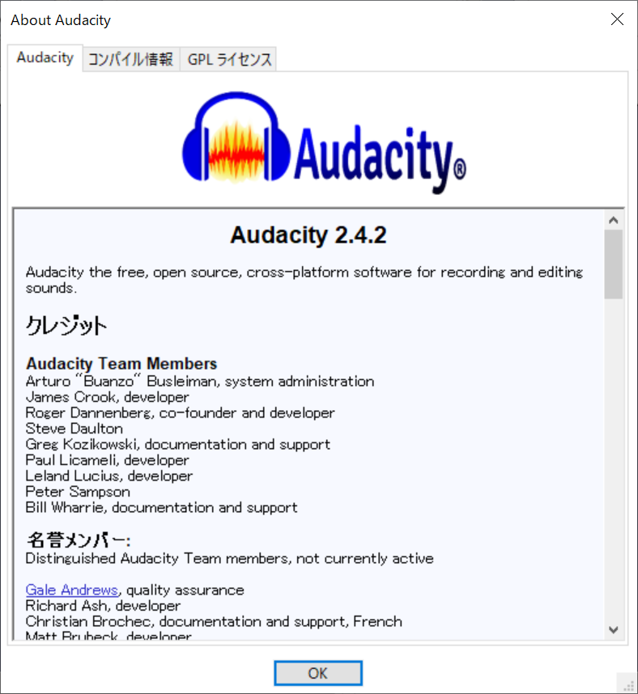

### 音声の入出力する方法について調べた

[PythonでWAVファイルの読み書きを行う](https://docs.python.org/ja/3/library/wave.html)

#### 倍音を足し合わせて正弦波以外の音を作ってみた。
正弦波よりも温かみがある音になった。

<audio controls="controls">
  <source type="audio/mp3" src="assets/audio/overtones.wav"></source>
  
https://github.com/Tsutomu-Ikeda/senior-project/blob/main/assets/audio/overtones.wav

</audio>

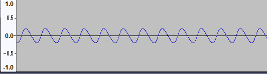

#### 261Hz 329Hz 391Hzの倍音を生成し足し合わせることで、和音を作ってみた
聞いていて心地良い音になった

<audio controls="controls">
  <source type="audio/mp3" src="assets/audio/harmony.wav"></source>
  
https://github.com/Tsutomu-Ikeda/senior-project/blob/main/assets/audio/harmony.wav

</audio>

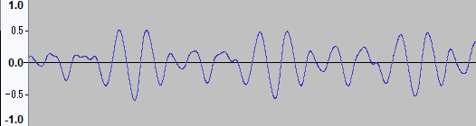

## 2020年10月18日

### 画像データをシリアライズして音声に変換する方法について考えてみている

- PythonのPILを使えばJPGやPNGなどの画像フォーマットの違いを気にせずにピクセルの情報を得れそう
- 10Hzの通信で、1つの信号で1bitを送ると考えると、10bit/sの通信速度
- SD画質(640px x 480px)を色深度4bitフルカラーで送る場合、4bit * 3 * 640 * 480 = 3,686,400 bit
- よって通信にかかる時間は 368,640秒 = 約4.2日…
- デモでやるとしたら長くても30秒くらいが良い…？
  - 30秒で送るなら 122,880 bit/s つまり、122kHzの信号にする必要がある。

## 2020年10月20日

### 登校して実験
- 去年の装置が動くか確認した
- 色んな周波数の正弦波、矩形波を生成した
- 矩形波は形が崩れ、情報を取り出すには難しそうな形になってしまった

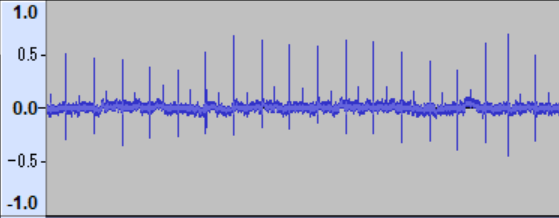

<audio controls="controls">
  <source type="audio/mp3" src="assets/audio/20201020/470microf_10Hz_square.wav"></source>
  
https://github.com/Tsutomu-Ikeda/senior-project/blob/main/assets/audio/20201020/470microf_10Hz_square.wav

</audio>
<audio controls="controls">
  <source type="audio/mp3" src="assets/audio/20201020/470microf_100Hz_square.wav"></source>
  
https://github.com/Tsutomu-Ikeda/senior-project/blob/main/assets/audio/20201020/470microf_100Hz_square.wav

</audio>
<audio controls="controls">
  <source type="audio/mp3" src="assets/audio/20201020/2200microf_10Hz_square.wav"></source>
  
https://github.com/Tsutomu-Ikeda/senior-project/blob/main/assets/audio/20201020/2200microf_10Hz_square.wav

</audio>
<audio controls="controls">
  <source type="audio/mp3" src="assets/audio/20201020/2200microf_100Hz_square.wav"></source>
  
https://github.com/Tsutomu-Ikeda/senior-project/blob/main/assets/audio/20201020/2200microf_100Hz_square.wav

</audio>

- 結局正弦波すら送ることはできなかった

## 2020年10月21日

### 投稿して実験
- 電荷が溜まっていないコンデンサならきれいな正弦波を送れることに気がついた

コンデンサの容量が多ければ多いほど安定した正弦波を送れる時間が長くなる

2200μF, 523Hzで送ったとき
- 2秒ごろ
  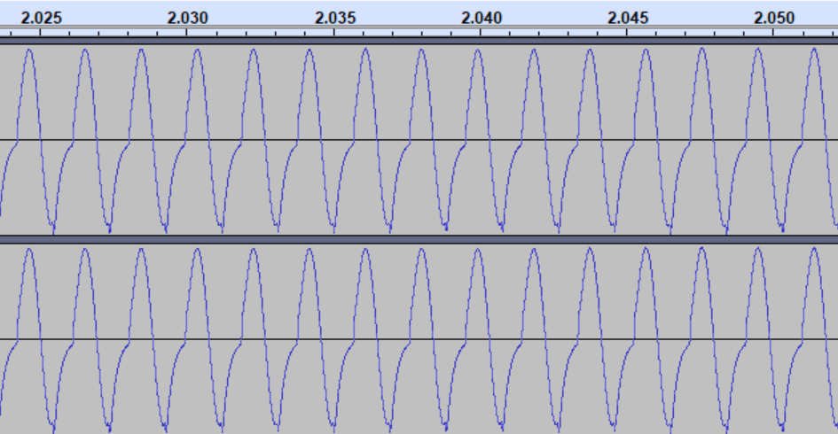
- 3秒〜10秒
  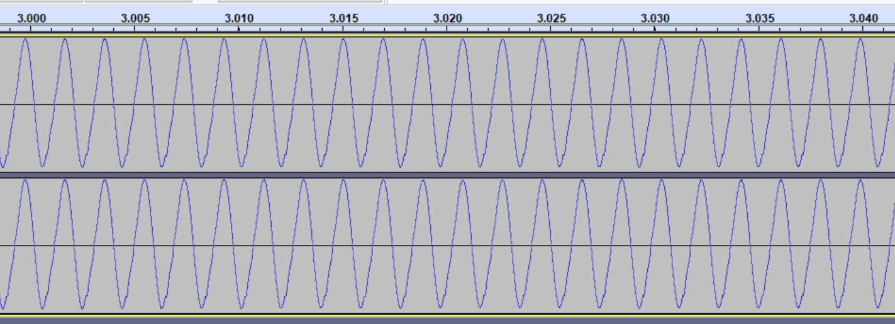
- 12秒ごろ
  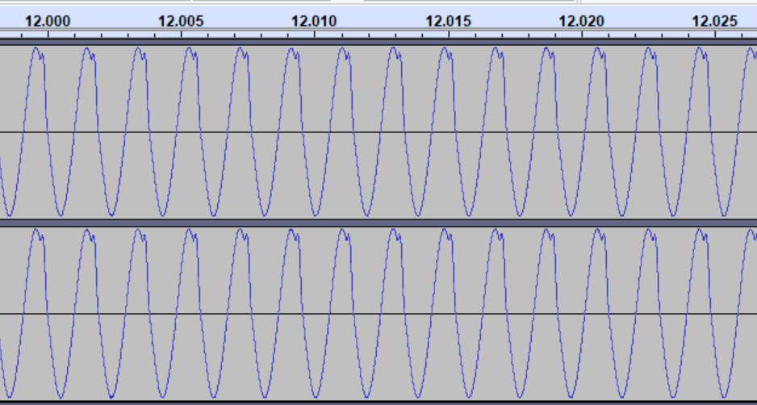
- 14秒ごろ
  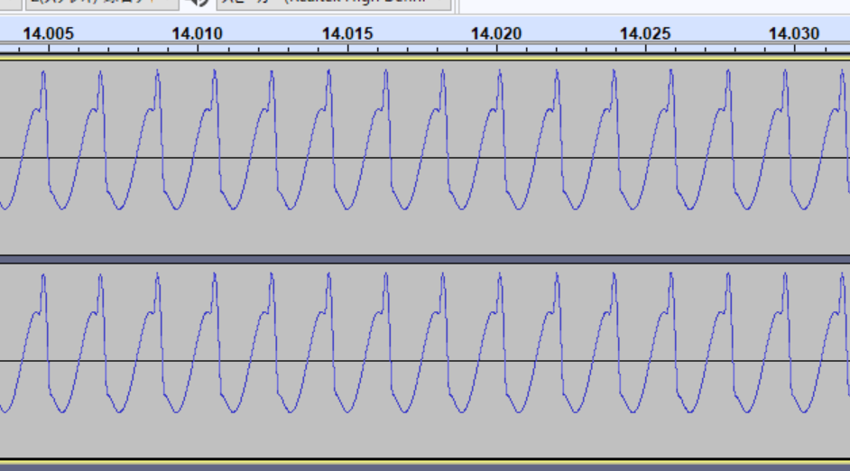

<audio controls="controls">
  <source type="audio/mp3" src="assets/audio/20201021/470microf_523Hz.wav"></source>
  
https://github.com/Tsutomu-Ikeda/senior-project/blob/main/assets/audio/20201021/470microf_523Hz.wav

</audio>
<audio controls="controls">
  <source type="audio/mp3" src="assets/audio/20201021/2200microf_523Hz.wav"></source>
  
https://github.com/Tsutomu-Ikeda/senior-project/blob/main/assets/audio/20201021/2200microf_523Hz.wav

</audio>

- 抵抗をコンデンサと入力の間に挟むと正弦波を送ることができた

<audio controls="controls">
  <source type="audio/mp3" src="assets/audio/20201021/40microF_100Hz.wav"></source>
  
https://github.com/Tsutomu-Ikeda/senior-project/blob/main/assets/audio/20201021/40microF_100Hz.wav

</audio>
<audio controls="controls">
  <source type="audio/mp3" src="assets/audio/20201021/40microF_523Hz.wav"></source>
  
https://github.com/Tsutomu-Ikeda/senior-project/blob/main/assets/audio/20201021/40microF_523Hz.wav

</audio>
</audio>
<audio controls="controls">
  <source type="audio/mp3" src="assets/audio/20201021/40microF_1000Hz.wav"></source>
  
https://github.com/Tsutomu-Ikeda/senior-project/blob/main/assets/audio/20201021/40microF_1000Hz.wav

</audio>

- 矩形波は結局送ることができなかった

<audio controls="controls">
  <source type="audio/mp3" src="assets/audio/20201021/40microF_100Hz_square.wav"></source>
  
https://github.com/Tsutomu-Ikeda/senior-project/blob/main/assets/audio/20201021/40microF_100Hz_square.wav

</audio>
<audio controls="controls">
  <source type="audio/mp3" src="assets/audio/20201021/40microF_1000Hz_square.wav"></source>
  
https://github.com/Tsutomu-Ikeda/senior-project/blob/main/assets/audio/20201021/40microF_1000Hz_square.wav

</audio>

## 2020年10月25日

- ブラウザで録音した音声をサーバー側で処理する仕組みを作った
- サンプリングレートは48000Hz, 変調周波数は4800Hz, 通信速度は4.8kbps
- JPEGのSOI(0xFFD8) EOI(0xFFD9)について調べた
- JPEGのバイナリから音声化する処理を書いた
- プリアンブルについてのメモ
  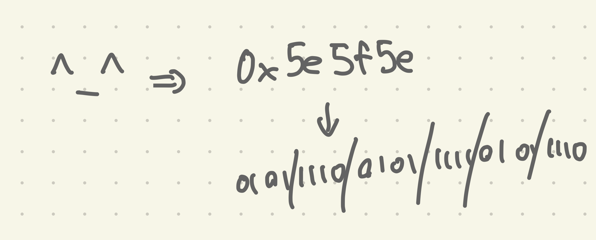

## 2020年10月26日

- 矩形波だと最後の方が結構ずれている→正弦波のOOKならずれないのではないか
  - ずれた
  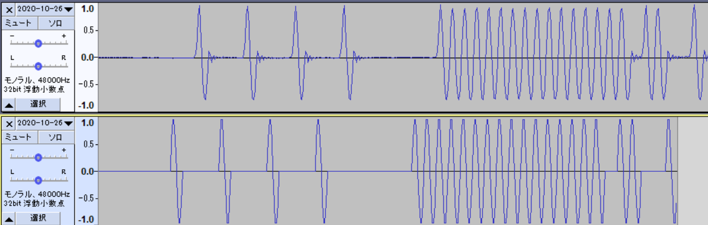
  - Audacityで録音しても同様の結果になった
  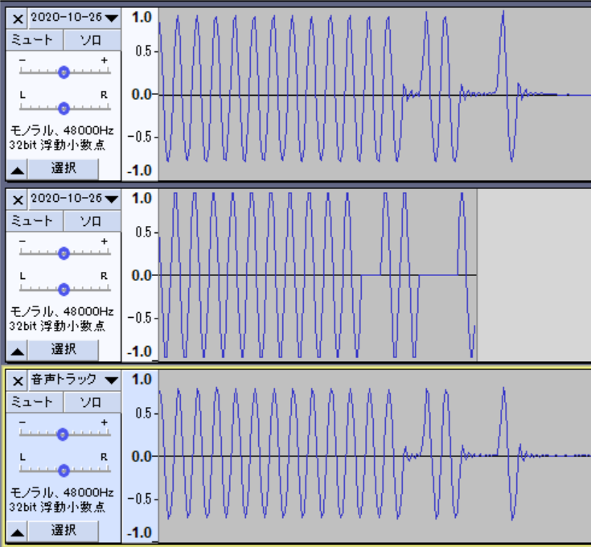
  - 正弦波を検出するアルゴリズム
  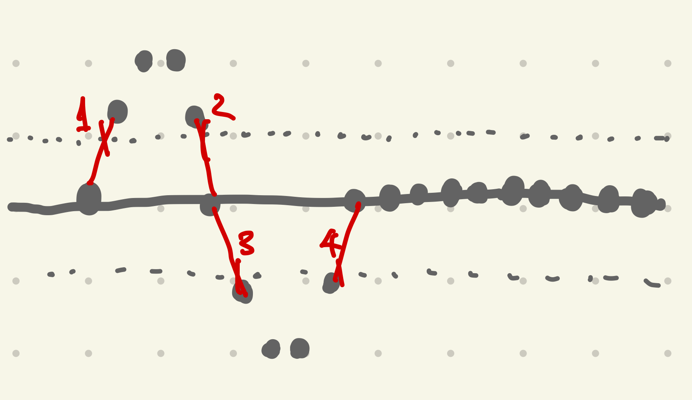

## 2020年10月28日

- 研究室で実験した
- 前回は矩形波を用いてLEDを点灯させることができなかったが、高橋先生に作っていただいたLT Spiceをもとに回路を見直した結果、うまくLEDを光らせることができた
  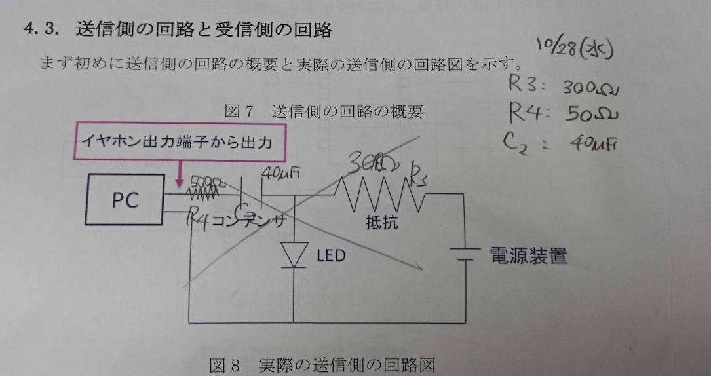
  - 2000Hzの矩形波を入力して結果の写真
    
- 実際に情報を含んだ信号を送信してみた
  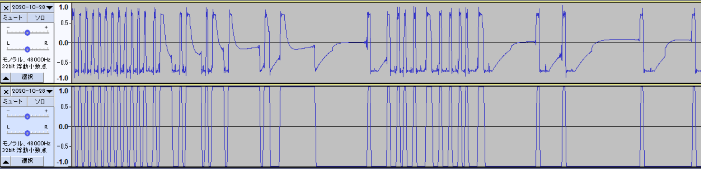
  0や1の符号が連続するところの波形は乱れているものの、かなりきれいに信号を送ることに成功した。
