<!--
class: title
_paginate: skip
-->

<!--
情報理工学科 高橋研究室に所属している池田力と申します。よろしくお願いします。
本日は可搬性に優れた光通信デモシステムの研究について発表いたします。
-->

# 可搬性に優れた光通信デモシステムの研究

2020年度 情報理工学科 卒業研究発表会 2021年1月30日(土)

A1778594 池田 力
指導教員 高橋 浩

---
<!--
_header: 本日の流れ
footer: 可搬性に優れた光通信デモシステムの研究
class: contents
-->

<!--
はじめに、本日の流れについて紹介します。
まず、研究のモチベーション、次に、デモシステムの概要、そして、直面した課題、実験結果の紹介、最後に、まとめとなっております。
-->

<h2>
研究のモチベーション
</h2>
<h2 style="text-align: right; width: 20%;float: left;">
1分
</h2>

<h2>
デモシステムの概要
</h2>
<h2>
5分
</h2>

<h2>
直面した課題とその解決手法
</h2>
<h2>
5分
</h2>

<h2>
実験結果の紹介
</h2>
<h2>
3分
</h2>

<h2>
まとめ
</h2>
<h2>
1分
</h2>

---
<!--
_header: 研究のモチベーション
-->

<!--
本研究は「光ファイバーを説明することが難しい」という課題を解決するために行われました。
実際に、Twitterで簡易的なアンケートを取ってみたところ、知っているが説明できないという方が最も多く、61.8%となりました。
この、光ファイバーという単語はなんとなく知っているけど、いざ説明するとなると難しいという課題は僕自身も感じていることです。
この課題は光ファイバーのデモシステムを作れば解決するのではないかと考え、デモシステムを作ることとしました。
次のスライドから実際に作ったデモシステムを紹介します。
-->

## 「光ファイバー」を説明することは難しい

<figure>

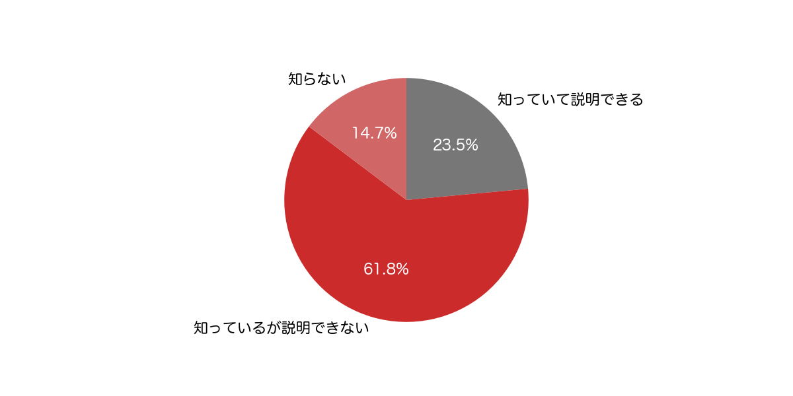

<figcaption style="font-size: 0.6em">
あなたは光ファイバーについて知っています/説明できますか？ 
N=34、アンケート形式: Twitter
</figcaption>
</figure>

---
<!--
_header: デモシステムの概要
-->

<!--
本研究で作った光通信デモシステムは大きく4つのパート、送信側ソフトウェア、送信側回路、受信側回路、受信側ソフトウェアにわかれています。
右上にデバイス構成の模式図を示しました。
左側の送信側パソコンから右側の受信側パソコンへ情報を光通信によって伝送する、デモシステムを作成しました。
実際に使用したデバイスの例も右下に示してあります。今回は実験中に回路を組み替えやすいようにブレッドボードを用いて実験しました。
続いて、処理の流れについて詳しく説明します。
-->

## 光通信デモシステムのデバイス構成

大きく4つのパートに分かれた

- 送信側ソフトウェア(PC上)
- 送信側回路
- 受信側回路
- 受信側ソフトウェア(PC上)

<figure>

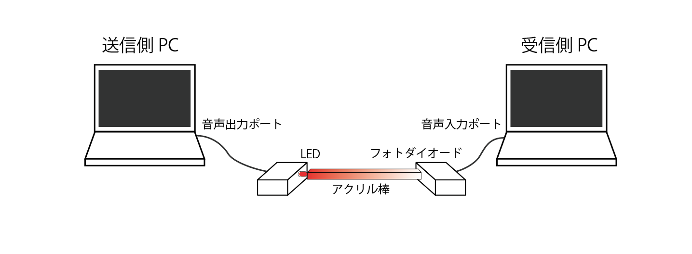

<figcaption>
デバイス構成の模式図
</figcaption>
</figure>
<figure>

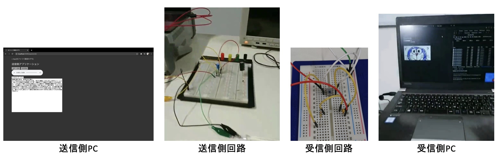

<figcaption>
実際に使用したデバイスの例
</figcaption>
</figure>

---
<!--
_header: デモシステムの概要
-->

<!--
処理の流れはおおまかに下部の図のようになっています。
まず、送信側ソフトウェアで伝送するデータを受け付けます。そのデータを元に変調信号の生成を行い、変調信号を音声出力ポートから出力します。
次に、送信側回路で、送信側パソコンから出力された電圧信号を元にLEDを明滅させます。
そして、光信号が受信側回路に届き、光信号が電気信号へ変換されます。
最後に、電気信号が音声入力ポートから受信側パソコンに入り、その信号から元のデータを復調し、受信画面に表示します。
4つのパートについて詳しく説明していきます。
-->

## 以下の流れで光ファイバー通信を再現している
- 送信側ソフトウェアでデータ受付、変調、音声出力を行う
- 送信側回路で変調信号でLEDを明滅させる
- 受信側回路で光信号を電気信号へ変換する
- 受信側ソフトウェアで音声入力、復調、データの表示を行う

<figure>

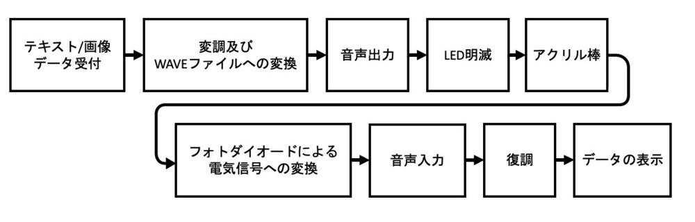

<figcaption>
処理の流れ
</figcaption>
</figure>

---
<!--
_header: デモシステムの概要
-->

<!--
送信側ソフトウェアです。
HTMLとJavaScriptで送信画面を作り、テキストや画像を入力できるようにしました。
受け取ったデータを送信側パソコン上で動いているWebサーバーに一旦送ります。
一旦Webサーバーにデータを送っているのは、Pythonを用いて処理を行うためです。
データをビット列として解釈し変調を行うことで、送信信号波形を生成します。送信信号波形の電圧変化を音声波形と見なし、WAVE形式のデータを作成します。
完成したWAVE形式のデータは送信画面に戻り、送信画面で再生され、音声出力ポートから電気信号として出力されます。

-->
## 送信側ソフトウェア
- HTML、JavaScriptで作った送信側画面でデータを受け取り、Webサーバーへ送る
- Webサーバー上で送信信号波形を生成し、電圧変化を音声波形と見なして、 WAVE形式のデータを作成する
- WAVE形式のデータを送信側画面に戻し、送信側画面で再生する

<figure>

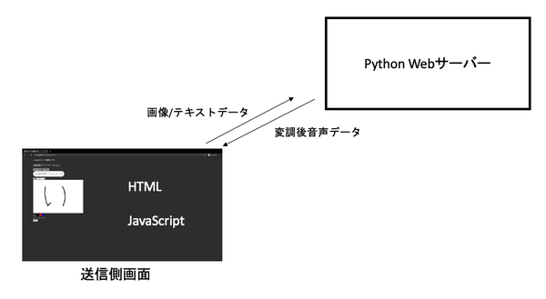

<figcaption>
データのやり取りの流れ
</figcaption>
</figure>

---
<!--
_header: デモシステムの概要
-->

<!--
送信側パソコンから出力された電気信号は左図のような回路で光信号に変換されます。
電気信号はもともと振幅が1Vなので、そのままLEDを明滅させることはできません。右図の電圧と照度の関係を見ると分かりやすいです。電圧が+1V〜-1Vの範囲ではLEDは上手く光らないため、元の電圧信号が失われてしまいます。
そこで、3.2Vだけ電圧をシフトさせています。そうすることで、電圧が4.2V〜2.2Vの範囲になり、電圧と照度の関係が比例関係になります。比例関係になり、波形が歪むことなく電気信号を変換できます。
-->

## 送信側の回路
送信側のコンピュータの音声出力ポートから出た電気信号を電圧を3.2Vだけシフトさせることで、LEDの照度と電圧が線形的に比例するようにしている

<figure>

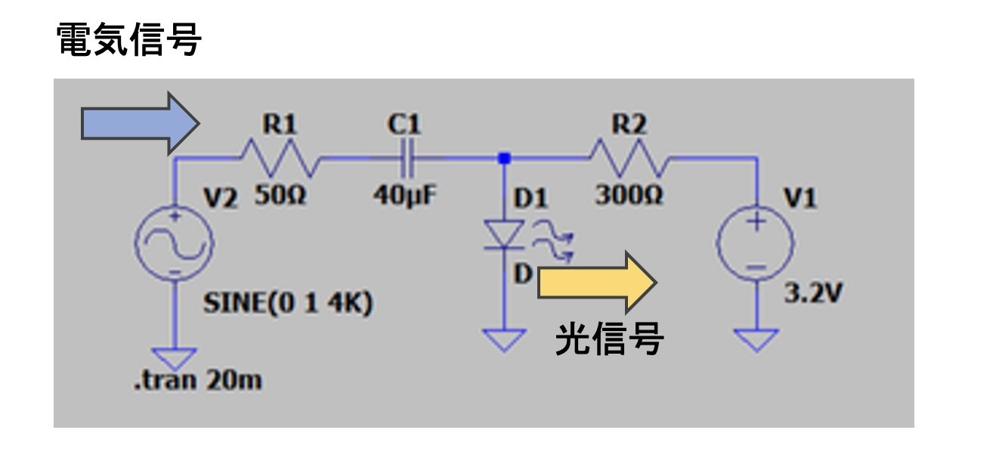

<figcaption>
送信側回路図
</figcaption>
</figure>

<figure>

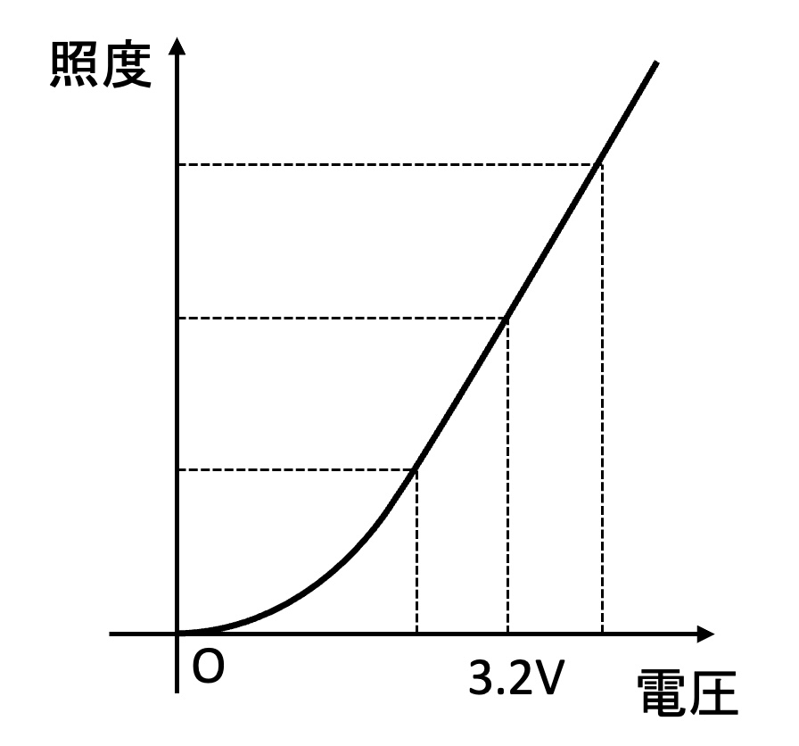

<figcaption>
入力電圧と照度の関係
</figcaption>
</figure>

---
<!--
_header: デモシステムの概要
-->

<!--
続いて、受信側回路について説明します。
受信側回路ではフォトダイオードを用いて光信号を電気信号へ変換しています。
今回はOPT101というフォトダイオードを用いました。OPT101はチップICとなっており、背面に光を当てることで照度に応じた電圧を5番ピンから出力します。
5番ピンからの出力電圧はR1の100KΩ抵抗を通って2番ピンに返されています。このような抵抗を帰還抵抗と呼び、100kΩにすることで増幅率が受信側パソコンの許容電圧に収まるようにしています。
また、5番ピンの出力電圧はC1のコンデンサを通ってから受信側パソコンに入力されます。このコンデンサはノイズがパソコンの回路を壊さないようにするために挿入されています。
-->

## 受信側の回路
OPT101という型番のフォトダイオードを使用し、光信号を電気信号へ変換した
図の帰還抵抗R1で増幅率を調節している
C1はノイズを除去するために挿入されている

<figure>

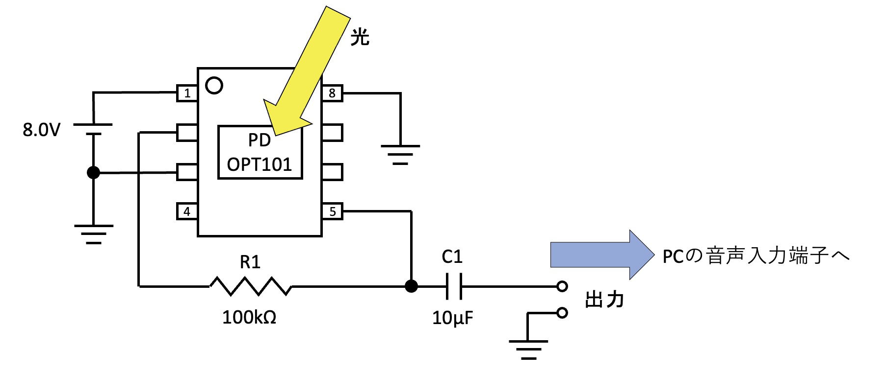

<figcaption>
受信側回路図
</figcaption>
</figure>

---
<!--
_header: デモシステムの概要
-->

<!--
受信側回路から出力された電気信号は受信側パソコンの音声入力ポートから入力されます。
パソコンの録音機能を用いて電圧波形を記録し、受信側パソコン上で動いているWebサーバーに送信されます。サーバーに送っている理由は送信側と同じくPythonで処理をするためです。
受信波形をPythonで復調処理し、元のデータを復元します。復調の詳細については後ほど解説します。
復調されたデータを受信側画面に戻し表示します。
以上のような流れで光ファイバーの通信を再現しました。

-->
## 受信側ソフトウェア
- 受信した電気信号をPCの録音機能を利用して記録し、 HTMLとJavaScriptで作った受信側画面からWebサーバーへ送る
- Webサーバー上のPythonスクリプトで復調を行う
- 復調されたデータを受信側画面に戻し、表示する

<figure>

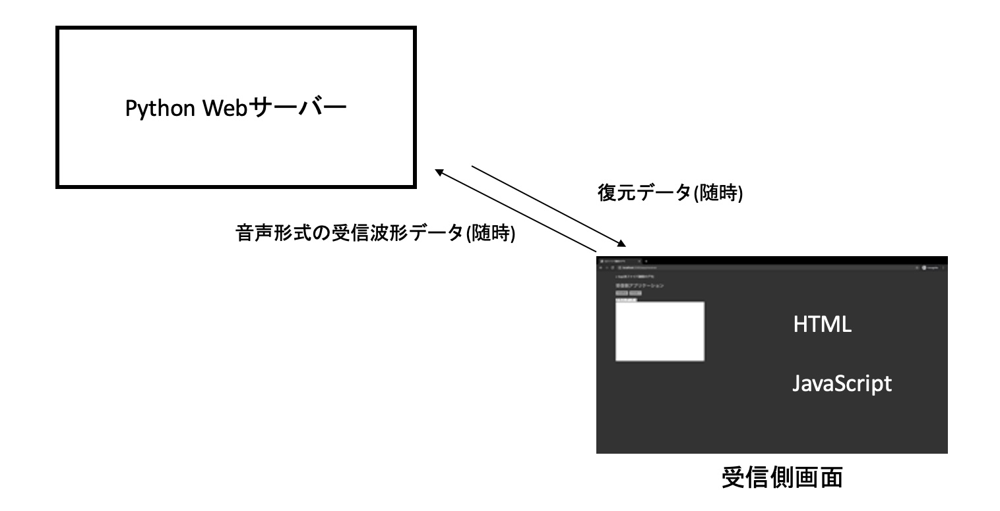

<figcaption>
データのやり取りの流れ
</figcaption>
</figure>

---
<!--
_header: デモシステムの概要
-->

<!--
サブキャリアについて
-->

<!--
続いて、変調方式について説明します。
今回、変調方式にはサブキャリアを使った振幅変調方式を採用しました。副搬送波周波数4,800Hz、データの変調周波数4,800Hzとしました。
サブキャリアというのは副搬送波を変調した信号でさらに搬送波を変調する方式のことで、少し特殊な変調方式になっています。

このような変わった変調方式を採用したのは、低周波成分が欠落することを防ぐためです。
下の図をご覧ください。上の波形が受信波形で下の波形が送信した波形です。受信波形を見ると、高い電圧が連続したところでいびつな形になっていることが分かります。
このように変形するのは受信側回路のコンデンサがハイパスフィルタの役割をし、低周波成分がカットされてしまったためと考えられます。

サブキャリアを採用することで、⾳声⼊⼒ポートを通る信号が副搬送波周波数の正弦波か、振幅が0の信号かどちらかになり、低周波成分を無くすことができます。
低周波成分がなくなることで、コンデンサの影響を無視できるようになりました。
-->

## 変調方式について
- サブキャリアを使った振幅変調方式を採用し、 副搬送波周波数$4{,}800\rm{Hz}$、データの変調周波数$4{,}800\rm{Hz}$とした
- 副搬送波を変調した信号でさらに搬送波(今回の場合、光)を変調する方式のことである

### サブキャリアを採用した理由
- 低周波成分が欠落することを防ぐため

<figure>

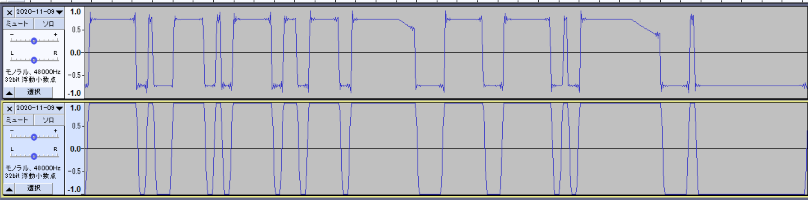

<figcaption>
同じ信号が連続し、信号が不安定になる例
</figcaption>
</figure>

---
<!--
_header: 直面した課題とその解決手法
-->

<!--
サブキャリアを用いることでコンデンサの問題を解決しましたが、それ以外にも復調にあたり困難が伴いました。
右図の通り、受信波形は0Vの位置がずれてしまう問題や、上下対象とは限らないという問題がありました。
また、1つ目の山と4つめの山を見比べると、最大振幅が大きく異なることが分かります。

さらに、サンプル落ちというのも大きな問題でした。次のスライドで説明します。
-->

## 受信波形からデータを復元するにあたり、以下のような問題が発生した

- 0Vの位置がずれてしまう
- 上下対称とは限らない
- 最大振幅のブレが大きい
- サンプル落ちが発生する場合がある

<figure>

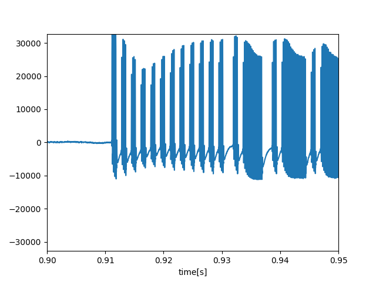

<figcaption>
受信波形の例
</figcaption>
</figure>

---
<!--
_header: 直面した課題とその解決手法
-->

<!--
サンプル落ちとは僕が勝手に名付けた現象のことです。
右図のようにサンプルの値に0が連続する区間が発生します。通常、送信側で0を示していても、ノイズが入るため、0だけが連続することは不自然です。
このような現象が発生する根本的な原因は分かりませんでした。しかし、おそらくA/Dコンバータのクロック誤差を補うために生成しているものと推測されます。
実際、この部分を無視しても問題なく復調することができました。

サンプル落ちは無視できましたが、0Vの基準がずれてしまったり、最大振幅のズレが大きいという問題は残っています。それを解決したのが
-->

### サンプル落ちが発生する場合がある

サンプルの値0が連続する区間が発生している
### 0が連続する区間が発生する理由
不明
おそらくA/Dコンバーターのクロック誤差を
補正するために作られていると推測する

<figure>

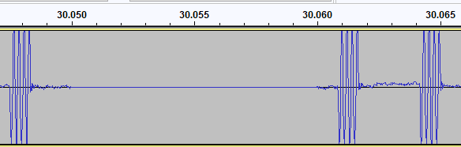

<figcaption>
サンプル落ちの例
</figcaption>
</figure>

---
<!--
_header: 直面した課題とその解決手法
-->

<!--
短時間フーリエ変換です。
ハニング窓関数を用いて80サンプルごとに切り出し、それぞれにフーリエ変換を用いることで特定周波数を抽出しました。

先程紹介した音声波形を短時間フーリエ変換を使い左図のような状態に変換しました。横軸が時間、縦軸が周波数、色の濃さが強さになっています。
左図からさらに変調周波数であった4,800Hzに関係する周波数成分を切り出したものが右図になります。
右図を見ると、0と1の符号がはっきり分かれていることが分かります。
この図の場合150,000あたりをしきい値に設定すると0と1の符号を判別でき、復調が行えそうです。
-->

## 短時間フーリエ変換による特定周波数の抽出

ハニング窓関数により80サンプルごとに切り出し、
それぞれにフーリエ変換を用いることで特定周波数を抽出した

<figure>

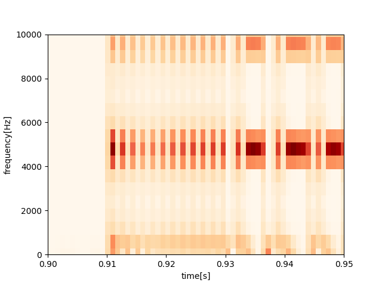

<figcaption>
周波数強度の時間変化
</figcaption>
</figure>

<figure>

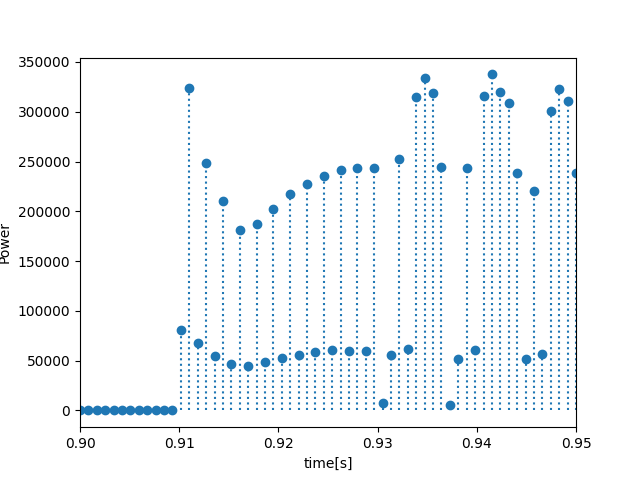

<figcaption>

$3{,}900\rm{Hz}$ - $5{,}700\rm{Hz}$ の 周波数強度の合計

</figcaption>
</figure>

ノイズの影響が少なくなり、しきい値を固定して復調ができるようになった

---
<!--
_header: 直面した課題とその解決手法
-->

<!--
ところが、それだけの工夫では大きいサイズのデータは復調できませんでした。
左の40KBのJPEG画像を伝送してみたところ、右のように復調途中でファイルが壊れてしまいました。
-->

## それだけの工夫では大きいサイズのデータを復号できなかった

### 全体40KBのうち、3KB程度を伝送した時点でファイルが壊れてしまった

<figure>

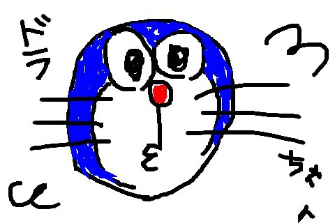

<figcaption>
オリジナルの画像
</figcaption>
</figure>

<figure>

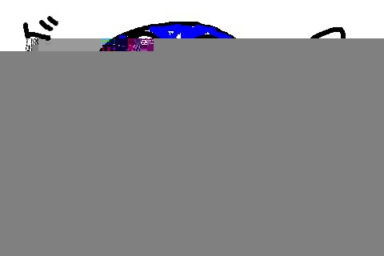

<figcaption>
復元された画像
</figcaption>
</figure>

---
<!--
_header: 直面した課題とその解決手法
-->

<!--
このように復調できなかったのは位相が徐々にずれてしまったためです。
受信側パソコンのA/D変換回路のサンプリングクロック精度の問題で、480,000Hzでサンプリングをしていても実際にサンプリングされているときには479,000Hzと小さくなっていたり、逆に大きくなっていることがあるのです。
-->

## 大きいサイズのデータを復元できない理由
受信側PCのA/D変換回路のサンプリングのクロック精度不足の影響で、
徐々に位相がずれていき、`0`・`1`の境界が近づいていくという現象が発生したから

<figure>

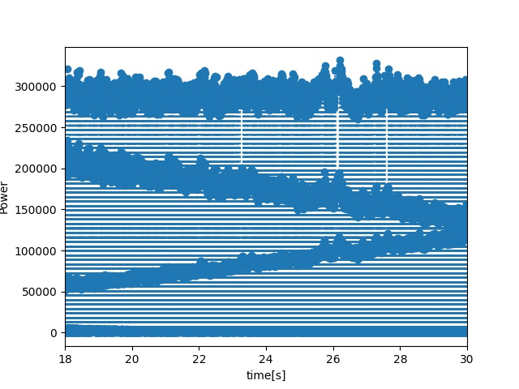

<figcaption>
位相がずれ、境界が近づいて行く様子
</figcaption>
</figure>

---
<!--
_header: 直面した課題とその解決手法
-->

<!--
この問題を解決したのも短時間フーリエ変換です。
フーリエ変換を行うと、複素数の列として結果が出てきます。先程は周波数の強度、複素数の絶対値しかみていませんでした。
この複素数の偏角を求めることで特定周波数の位相のずれを計算することができます。

左の図の青い点は黒い破線から-36°だけ位相がずれています。これをフーリエ変換したものが、真ん中の数字の列です。
青い点の周波数成分は上から3番目の複素数となっており、この複素数の偏角を計算することで、-36°だけずれていることがわかります。
このズレの計算を元に短時間フーリエ変換で切り出す範囲を調整することで位相のズレを補正することができます。

以上の通り、復調には様々な困難が伴いましたが、短時間フーリエ変換をうまく使いこなすことによって、問題なく復調できるようになりました。
次に、復調できることを確かめた実験結果について紹介します。
-->

## 短時間フーリエ変換による位相の同期

フーリエ変換の複素数の偏角を求めることで、位相のずれを計算できる

<figure>

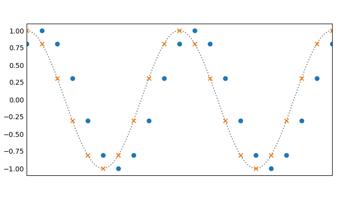

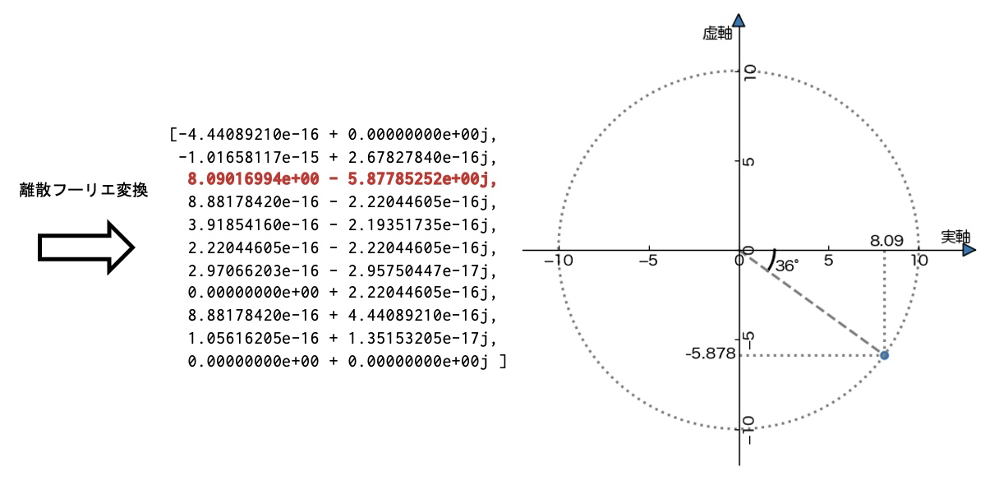

<figcaption>
フーリエ変換による位相算出のイメージ
</figcaption>
</figure>

---
<!--
_header: 実験結果の紹介
-->

<!--
実験用のデータとして3種類のデータを用意しました。
夏目漱石『吾輩は猫である』の冒頭815バイト分のテキストデータ、
480x320ピクセルの軽量画像、
480x320ピクセルの大容量画像です。
軽量画像と大容量画像が同じ画素数なのに容量が異なるのはJPEG形式で画像を圧縮しているためです。
-->

## 実験用に3種類のデータを用意した

<figure style="width: 800px; padding: 3%">

吾輩は猫である。名前はまだ無い。
どこで生れたかとんと見当がつかぬ。何でも薄暗いじめじめした所でニャーニャー泣いていた事だけは記憶している。吾輩はここで始めて人間というものを見た。しかもあとで聞くとそれは書生という人間中で一番獰悪な種族であったそうだ。この書生というのは時々我々を捕えて煮て食うという話である。しかしその当時は何という考もなかったから別段恐しいとも思わなかった。ただ彼の掌に載せられてスーと持ち上げられた時何だかフワフワした感じがあったばかりである。掌の上で少し落ちついて書生の顔を見たのがいわゆる人間というものの見始であろう

<figcaption>
テキストデータ 
夏目漱石『吾輩は猫である』の冒頭 (815B)
</figcaption>
</figure>

<figure class="image-with-border">

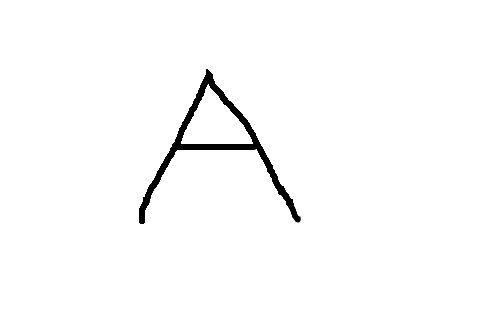

<figcaption>
軽量画像 (4.08KB) 
480x320ピクセル
</figcaption>
</figure>

<figure class="image-with-border">

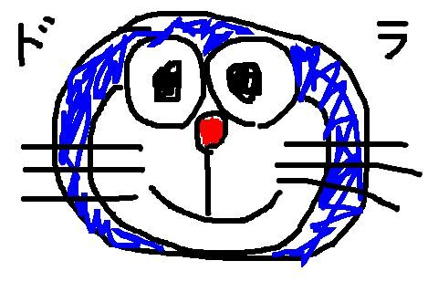

<figcaption>
大容量画像 (34.6KB) 
480x320ピクセル
</figcaption>
</figure>

同じ画素数で容量が異なるのは、JPEG形式で画像を圧縮しているため

---
<!--
_header: 実験結果の紹介
-->

<!--
3つのデータそれぞれを10回ずつ伝送しました。
ご覧の通り、30回中29回成功し、高い安定性を示しました。
軽量画像で1回だけ伝送が失敗しているのは、プリアンブルというデータの頭の部分を検知することに失敗したためです。逆に、プリアンブルの検知に成功すれば、データの伝送途中にエラーが発生しなかったとも言えます。
-->

## データを伝送が行えることを確認した

<figure>
<figcaption>
10回ずつデータを送った際の成否と送信時間
</figcaption>

| 種類       | サイズ | 試行回数 | 成功回数 | 伝送にかかった時間 |
| ---------- | -----: | -------: | -------: | -----------------: |
| テキスト   |   815B |     10回 |     10回 |                1秒 |
| 軽量画像   | 4.08KB |     10回 |      9回 |              5.2秒 |
| 大容量画像 | 34.6KB |     10回 |     10回 |               39秒 |

</figure>

- 軽量画像で1回失敗したのは、プリアンブルの検知に失敗したため
- プリアンブルの検知さえ成功すれば、データ全体の伝送を行えることがわかった

---
<!--
_header: まとめ
-->

<!--
まとめです。
本研究では可搬性に優れた光通信デモシステムを構築しました。
通信用途を想定していないデバイスを用いて安定的な通信システムを作るには多くの困難が伴いました。
そこで、
変調方式を工夫したり、短時間フーリエ変換といった手法を用いたりすることで、可搬性と安定性を両立したデモシステムを構築することができました。
また、
実験においても基本的な動作確認で高い安定性を確認することができ、完成度が高いデモシステムを作ることができたと言えます。
-->

## 可搬性に優れた光通信デモシステムの研究

- 通信用途を想定していないデバイスを用いて安定的な通信システムを作るには多くの困難が伴った
- 変調方式を工夫したり、短時間フーリエ変換といった手法を用いたりすることで、可搬性と安定性を両立したデモシステムを構築することができた
- 実験においても基本的な動作確認で高い安定性を確認することができ、完成度が高いデモシステムを作ることができたと言える
