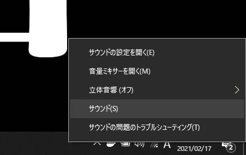
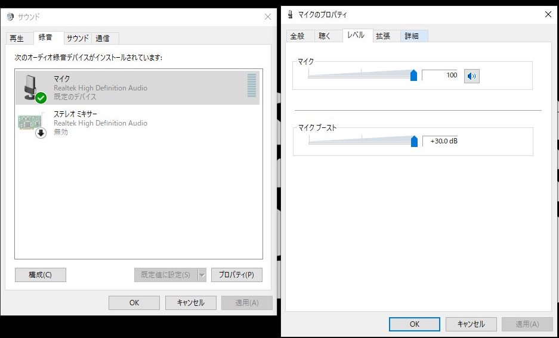
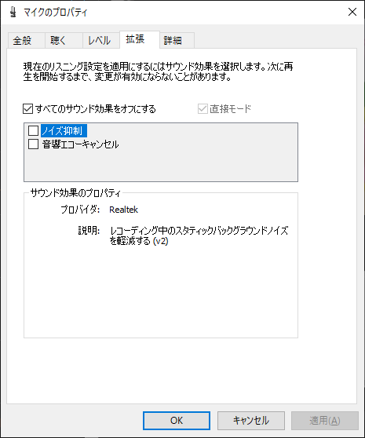
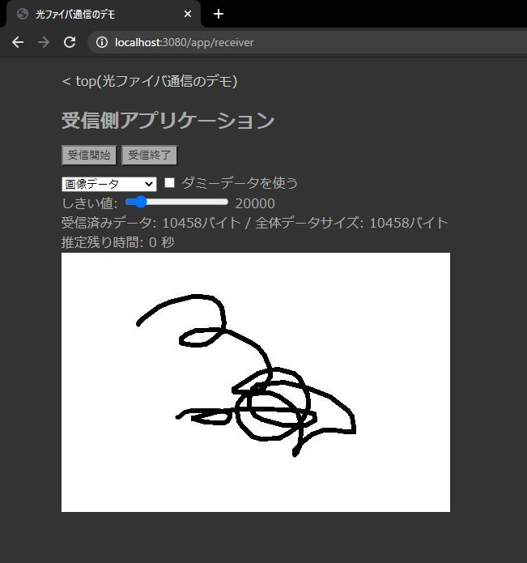

## 光通信デモシステム 研究室PCでの推奨設定

### OPT101の帰還抵抗値
1KΩ

### 送信側PCの設定

出力音量を最大(100)にする

### 受信側PCの設定

右下のスピーカーマークを右クリックし、「サウンド」の設定を開く

マイク設定: レベル100

マイクブースト30dB

 

「すべてのサウンド効果をオフにする」にチェックを入れる

受信側アプリケーションのしきい値を「20000」に設定する

