<!DOCTYPE html>
<head>
  <meta charset="UTF-8">
  <meta name="viewport" content="width=device-width, initial-scale=1" />
  <link rel="stylesheet" href="./paper.css" type="text/css">
  <link rel="stylesheet" href="https://cdnjs.cloudflare.com/ajax/libs/highlight.js/10.5.0/styles/default.min.css">
  <title>卒論本文－高橋研－池田力</title>
  <script type="text/x-mathjax-config">
  MathJax.Hub.Config({
    tex2jax: {
      inlineMath: [["$", "$"] ],
      displayMath: [ ['$$','$$'], ["\\[","\\]"] ]
    }
  });
  </script>
  <script type="text/javascript" async
    src="assets/MathJax.js?config=TeX-AMS_CHTML">
  </script>
</head>

<body>
<script src="https://cdn.jsdelivr.net/gh/highlightjs/cdn-release@10.5.0/build/highlight.min.js"></script>
<div class="head-title-wrapper">
<div class="head-title">

<div style="text-align: center;">
2020年度 卒業論文
</div>

# 可搬性に優れた光通信デモシステムの研究

指導教員 高橋 浩 教授

上智大学 理工学部 情報理工学科

A1778594 池田 力

</div>
</div>

<div class="toc-wrapper">
<div class="toc">

## 目次
  - [第1章 はじめに]()
    - [第1節 本論文の構成]()
  - [第2章 デモシステムの構成要素]()
    - [第1節 OSI参照モデル]()
      - [第1項 物理層]()
      - [第2項 プレゼンテーション層]()
    - [第2節 Webアプリケーション]()
      - [第1項 ユーザーインターフェイス]()
      - [第2項 GUI構築方法の比較]()
      - [第3項 HTML/CSS/JavaScript]()
      - [第4項 非同期通信/WebSocket]()
    - [第3節 ソフトウェア環境]()
      - [第1項 インタプリタ言語]()
      - [第2項 Docker]()
  - [第3章 デモシステムの概要]()
    - [第1節 処理の流れ]()
    - [第2節 変調方式]()
    - [第3節 送信側システム]()
      - [第1項 データ受付]()
      - [第2項 変調及びWAVEファイルへの変換]()
      - [第3項 音声出力]()
      - [第4項 LED明滅]()
    - [第4節 受信側システム]()
      - [第1項 フォトダイオードによる電気信号への変換]()
      - [第2項 音声入力]()
      - [第3項 復調]()
      - [第4項 データの表示]()
  - [第4章 実験による実証]()
    - [第1節 動作検証]()
    - [第2節 通信速度の検証]()
    - [第3節 通信の安定性の検証]()
  - [第5章 今後の展望]()
    - [第1節 通信速度について]()
    - [第2節 通信の安定性について]()
    - [第3節 可搬性について]()
  - [第6章 まとめ]()

</div>
</div>

---

## 第1章 はじめに

光ファイバーを用いた光有線通信の重要度は近年ますます高まっている。
2020年には第5世代移動通信システム(5G)が携帯電話キャリア各社からサービスの提供が開始されるなど、無線通信の通信速度が向上している。
しかし、光ファイバーによる有線通信が不要になるわけではなく、むしろ必要性が増している。
携帯電話の基地局間における通信やクラウドサービスのデータセンターには非常に大きな帯域が必要であり、光通信なくしては快適なインターネット環境は成り立たない。
光通信はいわば幹線道路であり、末端の交通量(通信量)が増えれば増えるほどより車線数の多い道路(帯域が広い通信経路)が必要になるのである。実際、JPIX社が公式サイトで公開している情報によると、毎秒1テラビットもの情報がやりとりされており[1]、非常に大きな帯域が必要であるとわかる。

その一方で、通信工学の専門知識を持たない人々に光ファイバーを説明することは難しい。
これは日常生活において光ファイバーを触ったりする機会が少ない分、イメージが湧きにくいものであるからである。
実際に見たり触ったりしたことないものの理解が難しいことは執筆者も常々感じていることである。
光通信デモシステムを開発することはより多くの人が光ファイバーの仕組みや有用性を理解するのに大きな役割を果たすだろう。

本研究では、特殊な機器を用いることなく容易に入手できる部品や技術のみを用いてデジタルの光ファイバー通信デモシステムを開発した。
ここでいう特殊な機器とは、高額であったり専門店に出向かないと手に入らなかったりするようなもののことである。
今回用いた機器は全てインターネットショッピングで購入でき、かつ価格もノートPCを除くと一番高額なもので数百円程度のものである。
また、使用したソフトウェアも全て無料でダウンロードできるもので、手順に従えば誰でも再現できるように配慮した。

### 第1節 本論文の構成

本論文の構成について章の内容を交えながら説明する。

第2章ではデモシステムの構成要素として、研究を行うにあたり事前に調べたこと、使った知識について説明する。OSI参照モデル、Webアプリケーション、ソフトウェア環境の3つの節に分けた。<br>OSI参照モデルの節では、光ファイバーが属している物理層と最も上位の層であるプレゼンテーション層について調べた。物理層を調べることで、光ファイバーが通信においてどのような役割を果たしているのかを明らかにした。<br>
Webアプリケーションの節では、柔軟性・可搬性が高いアプリケーションを構築するのにWebアプリケーションを用いる方法と他の手法を比較した。また後半では、HTML、JavaScriptを用いたGUIの簡単な例を示している。<br>
ソフトウェア環境の節では、プログラムを動作させるのに必要なアプリケーションを可搬性を保ちながらインストールするにはどうすれば良いのか検討した。コンパイルが不要なインタプリタ言語、仮想環境でプラットフォームの依存をなくすDockerについてまとめている。

第3章では実際に作成したデモシステムの概要について解説する。
最初に処理の流れを示し、その次に変調方式にサブキャリアを用いた理由を説明する。<br>
その後、処理の流れの順にデータ受付、変調及びWAVEファイルへの変換、音声出力、LED明滅、フォトダイオードによる電気信号への変換、音声入力、復調、データの表示の8つの項に分けて解説する。前半の4つの項は送信側システムについて、後半の4つの項は受信側システムについて解説している。<br>
ソフトウェアに関する項については、適宜ソースコードを交えて詳細に説明する。なお、ソースコードの全体は https://github.com/Tsutomu-Ikeda/senior-project に載せてある。数万字程度の量になっているため本論文に全てを掲載することはしない。

第4章では作成したシステムが目的通り動作するか実験したことについて述べる。テキストデータ、軽量画像、大容量画像の3種類を用意し、システムの安定性と速度を確認した。また、わざと通信が失敗させ、通信に失敗するとデータがどのように毀損されるのかについても確かめた。

第5章では本デモシステムで実現できなかった部分を洗い出し、今後の展望について論じる。デモシステムにおいて重要な3つの要素である、通信速度、安定性、可搬性について節を分けて展開する。

第6章では本研究の目的、得られた成果を簡潔にまとめる。本研究の一番の目的である可搬性が実現されたか、それを実現するためにどのような工夫をしたのかが分かるように記述する。

---

## 第2章 デモシステムの構成要素

本研究は光ファイバーの仕組みを再現したデモシステムを作ることで専門知識を持たない人でも光ファイバーについて理解を深められるようにすることを目的としている。
光ファイバーはインターネット通信の階層の中でも最も低いところに位置する。
そのため、普段インターネットを利用する際に意識して使う機会が少なく、そのことが光ファイバーが難しいものであると印象づけている一因となっていると考えられる。<br>
現実のインターネット環境がどのように構築されているかを調べることで、デモシステム構築の手がかりにする。また、デモシステムの可搬性を実現するために有用な知識についても調べたことを紹介する。

### 第1節 OSI参照モデル

OSI参照モデルは国際標準化機構(ISO)によって策定された1994年に通信システムのモデルである。通信機能を実現するための7階層が定義されており、最も高いレイヤーから、アプリケーション層、プレゼンテーション層、セッション層、トランスポート層、ネットワーク層、データリンク層、物理層に別れている。
通信機能を階層構造で定義することによって、複雑なネットワークの設計を分担し、規格化しやすくしている。

それぞれの層について簡易的な説明を行う。<br>
アプリケーション層、プレゼンテーション層、セッション層ではセッションを確立し、我々が利用しているアプリケーションと直接データのやり取りを行っている。代表的なプロトコルとしてHTTPやFTPがあり、データの圧縮や暗号化などの方式を規定している。<br>
トランスポート層は通信相手とのコネクション(接続)を管理し、データを通信相手まで届けるための層である。TCPやUDPといったプロトコルが有名である。<br>
ネットワーク層は通信相手までの経路を制御するための層である。Internet Protocol(IP)が最も有名である。IPアドレスと呼ばれる固有アドレスを端末ごとに付番することで、世界中の端末と通信を行えるようにしている。<br>
データリンク層はデータを分割して転送を行ったり、物理アドレスの規定をしたりするための層である。物理アドレスとして一般的にMACアドレスが用いられており、48ビットのIDを値としている。そのため、理論上 $2^{48} = 281,474,976,710,656 \simeq 281.5 兆個$ のデバイスを識別することができる。<br>
物理層は物理的な接続の方法や信号の符号方式、変調方式を規定している。具体例として光ファイバーや携帯電話の電波、電話回線を用いたADSLなどがある。<br>
以上のようにそれぞれの層でさまざまなプロトコルが存在する。しかし、階層構造になっていることで物理層のプロトコルを差し替えても通信が成り立つということがこのモデルの大きな利点である。

#### 第1項 物理層
本研究の対象である光ファイバーは物理層に属していた。そこで物理層をより深く検討してみよう。
物理層の定義はISO/IEC7498-1第2版の第7章第7節第2項[2]によると以下の通りである。
> The Physical Layer provides the mechanical, electrical, functional and procedural means to active, maintain, and de-active physical-connections for bit transmission between data-link-entities. A physical-connection may involve intermediate open systems, each relaying bit transmission within the Physical Layer. Physical Layer entities are interconnected by means of physical medium.

##### 執筆者による日本語訳
> 物理層はデータリンクエンティティ間のビット伝送のための物理的接続を有効にしたり、維持したり、無効にしたりする機械的、電気的、機能的、手続き的な方法を提供する。物理的接続は開放型システムを介した接続も含み、各システムは物理層におけるビット伝送を中継する。物理層のエンティティは物理的な媒体によって相互的に接続される。

今回、以上の定義における物理的な媒体には光ファイバーが当てはまる。光ファイバーはルーティングや誤り訂正の責務を負わない。レーザー光を点灯した状態と消灯した状態を繰り返すことで、 `0` と `1` を表現し、ビット伝送を行うのである。

さらに、ISO/IEC7498-1第2版では物理層がデータリンク層に対して提供するべき7つの要素を以下のように定めている。(括弧内は原文)

- 物理的接続 (physical-connections)
- 物理的なデータ単位 (physical-service-data-units)
- 物理的な接続端子 (physical-connection-endpoints)
- データ回線の識別 (data-circuit identification)
- データの順序付け (sequencing)
- 故障状態の検知 (fault condition notification)
- 帯域制御の提供 (quality of service parameters)

この中で物理的なデータ単位は通常 `0` か `1` かで表現され、単位は1ビットである。しかし、無線通信においてはQPSKと呼ばれる位相変調方式によって一度に4状態(2ビット)の情報を送る場合もある。<br>
物理的接続、物理的な接続端子、データ回線の識別はこれらを定義し、提供することにより拡張性の高いネットワークを構築できる。もし、機器によって接続方法が異なっていたり、接続をしても回線が識別できず通信ができなかったりすると、大規模なネットワークを構築できなくなってしまう。<br>
その他多くの項目が定義されているが、いずれもネットワークの信頼性・可用性を向上させるためのものである。
物理層では多くの機能が提供されていることが分かった。しかし、これらを全てデモシステムで再現することは困難であるため、今後の設計・実装の段階では必要なものの検討を行いたい。

#### 第2項 プレゼンテーション層
プレゼンテーション層はインターネットの利用者に対して2番目に近い層である。逆に物理層と離れている層だが、デモシステムを構築するにあたってデータを表示する仕組みについて検討する必要があり、それにはプレゼンテーション層について理解が必要である。そこで、物理層と同じようにISO/IEC7498-1第2版を引用しながらプレゼンテーション層がどのようなものなのか考えてみよう。

アプリケーション層には3つの目的があるとされている。
- アプリケーションエンティティが通信・参照する情報の表現方法を提供する。
- アプリケーションエンティティ間で転送されるデータの共通の表現方法を提供する。これによりアプリケーションエンティティ同士があらゆる目的で共通の情報の表現方法を持つのを容易くする。言い換えれば、文法(データの表現方法)による依存をなくす。
- 伝送中にデータが変わっていないことを保証する。互いに通信するアプリケーション層は通信で使用する文法を決定しなければならない。プレゼンテーション層は使用できる文法を知ることができるため、お互いに使用可能な文法を決定する。

上記の3つをまとめると、プレゼンテーション層はデータの表現方法が通信するアプリケーション同士で同じになるようにし、送ったデータがしっかりと正しいことを保証するために存在しているということになる。

ただ、一般的な通信プロトコルにおいてプレゼンテーション層のみを提供するものは存在しないが、他の層と組み合わせたプロトコルが提供されている。例えば、プレゼンテーション層を含むプロトコルとしてHTTPやFTPなどがあり、セッション層を含むプロトコルとしてTLSがある。<br>
HTTPはアプリケーション層に属し、リクエストを送る形式、レスポンスを返す形式が決められており、先ほど紹介した3つの目的のうち、最初の2つを満たすものである。<br>
また、TLSはセッション層に属し、通信の暗号化及び同一性を行っており、セッションを確立する際にお互いに使用可能であるかを確認している。これは最後の目的を満たす。
このようにプレゼンテーション層は物理層と比べて定義が難しいものであった。デモシステムの設計・実装においてはHTTPやTLSの仕組みを参考にしながら独自に考えていく必要があるだろう。

### 第2節 Webアプリケーション

#### 第1項 ユーザーインターフェイス

ユーザーインターフェイスとは、利用者(ユーザー)に対して提供される操作画面(インターフェイス)のことである。利用者に対して情報を出力したり、逆に利用者から命令を受け取ったりする。

ユーザーインターフェイスには大きな分類としてCUIとGUIがあり、CUIはディスプレイで文字を表示することで情報を提示し、命令はキーボードの文字入力により受け取る。GUIは文字以外にも表現力の高いグラフや画像を駆使することで多くの情報を提示し、命令はキーボード、マウスやタッチパネルにより受け取る。<br>
コンピュータが一般に普及し始めたばかりのころは、CUIと呼ばれる文字を印字するだけのものしかなかった。なぜなら昔のコンピューターは処理能力やディスプレイの解像度が現在ほどは高くなく、高度なレンダリングができなかったためである。<br>
CUIのアプリケーションは基本的に文字入力と文字出力を行えば良いため、GUIのアプリケーションに比べて構築が容易であるというメリットがある。一方で、アプリケーションを熟知していないと情報をどのように入力してよいか分からなくなってしまいやすいという危険性もある。<br>
GUIのアプリケーションの歴史は古く、1950年代にIBM社がアメリカ空軍の防空システムを作ったことが始まりとされる[3]。しかし、一般人が購入できるコンピュータでGUIが導入されたのは1984年にApple社が発売したMacintoshである。その後、コンピュータの処理能力の向上やスクリプト言語の発展、GUIを構築するためのツールの充実などにより、GUIが広く普及したことで、一般的なユーザーが利用するアプリケーションのほとんどはGUIとなっている。

#### 第2項 GUI構築方法の比較

今回は専門知識を持たない人に見せるためのデモシステムであるため、GUIをベースとして構築することが良いだろう。GUIをどのように作るかを検討していく。GUIを構築する方法はいくつかある。<br>
例えば、WindowsではVisual Studioという統合開発環境でVisual Basicを用いたWindows Formsが有名である。コードをたくさん記述しなくてもGUIアプリケーションを作れるというメリットがある一方で、Windowsでしか動作しないというデメリットもある。
MacOSではXCodeでSwiftを用いてアプリケーション開発を行うことが多い。XCodeさえあれば、iOSアプリ、デスクトップアプリを簡単に作れるというメリットがある一方で、iOSアプリを公開するにはApple社に年間99ドルを支払う必要がある。そのため、手軽に公開できるとは言い難い。<br>
あらゆる端末で動作し、かつ手軽に公開できるGUIアプリケーションを構築する方法として、HTMLとCSS、JavaScriptを用いたWebアプリケーションと呼ばれる方法がある。HTMLとCSSで表示画面の見た目を整え、JavaScriptでユーザーの命令を受け取り動的にページを変化させるのである。<br>
HTMLの表示やJavaScriptの実行は、全てブラウザ上で行われる。ブラウザはGoogle社やApple社などがあらゆるプラットフォーム向けに実装している。そのため、OSやCPUのアーキテクチャが変わっても、同じコードで対応することができる。<br>
Webアプリケーションの配布はWebサーバーを公開することで、世界中からアクセスすることができる。ただ、Webサーバーを維持するのに月額数千円の費用がかかってしまうことから、本研究に適していないと考えられる。そこで、デモシステムの利用者自身が使うコンピュータの上にサーバーを構築し、そこにアクセスするという方法を取ることで、デモシステム公開のコストを極限まで下げることができる。ただ、Webサーバーの環境構築などを手作業で再現することは、ある程度知識が無いと困難であり、アプリケーションのバージョンの組み合わせによっては動かないことがあるという問題がある。このような問題はプラットフォームの仮想化及び自動化を行うことによって解決できる。詳しくは第2章第3節のソフトウェア環境で述べることとする。<br>
なお、Webアプリケーションは特定のプラットフォームに特化したアプリケーションに比べてパフォーマンスが劣化するデメリットや、プラットフォーム特有のデバイスが使用できない問題がある。しかし、本研究で扱うデータのサイズがそこまで多くないこと、近年低価格のコンピュータでも性能が向上していることを踏まえると大きな問題ではないと考えられる。<br>
以上の内容をまとめると、表1の通りとなる。本研究の要件を満たすためにはWebアプリケーションによって構築することが良いことがわかる。

<figure>
<figcaption>表2.1 構築方法によるメリットデメリットの比較</figcaption>

| 構築方法              |       使用言語        | 維持費 | 可搬性 | 難易度  | 性能  |
| --------------------- | :-------------------: | :----: | :----: | :-----: | :---: |
| Windows Forms         |   Visual Basic / C#   |   ○    |   ✕    | ○(簡単) |   ○   |
| Swiftアプリケーション |         Swift         |   △    |   △    |    ○    |   ○   |
| Webアプリケーション   | HTML, CSS, JavaScript |   ○    |   ◎    |    △    |   △   |
</figure>

以下の節ではWebアプリケーションを構築するために必要な知識について論じる。

#### 第3項 HTML/CSS/JavaScript

HTMLはHyperText Markup Languageの略で、その名前の通りハイパーテキストの構造を記述するための言語である。ハイパーテキストはプレーンテキストと対比されて用いられる言葉で、文字のサイズを変えたり、色をつけたりしたものを指す。また、画像を挿入することや、リンクを入れて別のWebページを参照することもできる。文章を構造化することでプレーンテキストよりも効率的に扱うことができることも大きな利点である。<br>

<figure>

```html
<h1>文章表題</h1>
<p>ここに<b>文章の本文</b>を<big>入れます。</big></p>
```

<iframe width="100%" src="data:text/html;charset=utf-8,%3Ch1%3E%E6%96%87%E7%AB%A0%E8%A1%A8%E9%A1%8C%3C%2Fh1%3E%3Cp%3E%E3%81%93%E3%81%93%E3%81%AB%3Cb%3E%E6%96%87%E7%AB%A0%E3%81%AE%E6%9C%AC%E6%96%87%3C%2Fb%3E%E3%82%92%3Cbig%3E%E5%85%A5%E3%82%8C%E3%81%BE%E3%81%99%E3%80%82%3C%2Fbig%3E%3C%2Fp%3E">
</iframe>

<figcaption>図2.1 HTMLによる文字装飾の例</figcaption>
</figure>

図2.1のようにHTML単体でも装飾(サイズ変更、色付け)をすることはできるものの、文書の構造と装飾を一緒にするとファイルが肥大化してしまう恐れがある。そのような事態を避けるために生まれたのがCSS、Cascading Style Sheetsである。CSSを用いることで文字の装飾だけでなく、要素の配置方法など高度なデザインを行えるようになった。クラス名の指定などによるスタイルの変更の例を図2.2に示した。<br>
現在では、HTMLファイル自体に `<style>` タグを埋め込むことで直接CSSを記述できるようになっている。これによってファイルの肥大化の回避というメリットが薄まったことになるが、それでもなおCSSの記法はスタイリングの抽象度を高める上で重要な役割を果たしている。<br>

<figure>

```html
<style>
  h2 { color: red; }
  .dark {
    background-color: #333;
    color: #fff;
  }
  .text-big { font-size: 1.3em; }
</style>
<h1>文章表題</h1>
<p>ここに文章の本文を入れます。</p>
<h2>第1章</h2>
<div class="dark">
  この領域の背景は黒くなります。
</div>
<h2>第2章</h2>
<div class="dark text-big">
  この領域は背景が黒くなる上に文字が大きくなります。
</div>
```

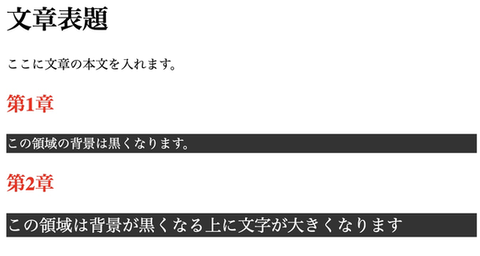

<figcaption>図2.2 CSSによる高度な装飾の例</figcaption>
</figure>

JavaScriptは現在のブラウザにおいて動作する唯一のスクリプト言語である。DOM操作や非同期通信などの機能を持ち、HTMLファイルを動的に変更したり、ユーザーから受け取った情報をサーバーへ非同期的に送ったりすることができる。JavaScriptの誕生により、Google Mapsのような継ぎ目のないWebアプリケーションを構築できるようになった。Google Mapsでは、世界中の地図を閲覧するのに縦横に自由にスクロールできる。それまでのWebアプリケーションではユーザーの操作を受け付けるたびにページの再読み込みが必要だったのに対して、非同期通信により再読み込みが不要になったのである。

<figure>

```html
<h1>文章表題</h1>
<p>ここに文章の本文を入れます。</p>
<div class="target">
  この場所の内容は10秒後に変化します。
</div>
<script>
  setTimeout(() => {
    document.querySelectorAll(".target").forEach((elem) => {
      elem.innerHTML = "内容が書き換わりました。"
    })
  }, 1000 * 10);
</script>
```

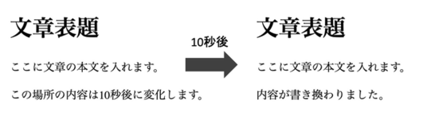
<figcaption>図2.3 JavaScriptによるDOM操作の例</figcaption>
</figure>

#### 第4項 非同期通信/WebSocket

非同期通信はJavaScriptによるWebアプリケーションの特徴を論じる上で非常に重要なものである。そこで、独立した節として紹介する。

非同期通信が必要となるアプリケーションは以下の3つに分類できる。
- 共有のデータベースにアクセスする必要があるとき。
- 処理に計算リソースを多く使うか、プログラムのサイズが大きいなどの理由で利用者の端末により処理をすると時間がかかる場合。
- JavaScript以外の言語で処理を書きたいとき。

1つ目は最も一般的な利用例である。Webアプリケーションの機能としてユーザーの認証情報を保存したり、受け付けた情報を保存したりする際にデータベースを利用することが普通である。保存した情報を取り出す際にもデータベースにアクセスする必要があるが、その際は非同期通信を介してやり取りを行う。<br>
2つ目は特殊な例である。計算リソースを使う処理をしなければならないことが少ないことと、近年の技術発展により端末の処理能力が向上していることが関係している。また、プログラムのサイズが大きくなるということもあまり多くない。ただ、どうしてもサイズが大きくなる場合、ネットワークを介して巨大なプログラムを転送するのは多くの時間を要するため、処理の結果だけを転送することは有用である。<br>
3つ目は言語による得意分野が異なることによって発生するものである。例えば、機械学習を行いたい場合を考えると、機械学習の基本的な実装から全てプログラムを書くわけにはいかないので、通常ライブラリを用いる。機械学習の場合、Pythonが最もライブラリが豊富な言語であるが、Pythonはブラウザ上でそのまま実行することはできない。そこで、非同期通信を介して処理結果のみを伝えることで、Pythonのライブラリを有効活用することができる。ライブラリを使わない場合でも、開発者が得意な言語を用いて開発を行うことができるため、柔軟なシステム設計が可能となる。

非同期通信において通信を行う方式の代表例に2つある。REST(HTTP/1.1)とWebSocket(HTTP/2)である。RESTではクライアントからサーバーへリクエストを送り、それに応じてレスポンスを返すという形をとっている。どんな操作をしたいか、どんな情報が欲しいかという内容をリクエストメソッドとパスの組み合わせで表現する。例えば、トップページが欲しいとき、トップページを表す `/index.html` と情報の提供をしてくださいを表す `GET` メソッドを合体し、 `GET /index.html` というリクエストの形式になる。情報を保存する処理をしたい場合、 `POST` というメソッドと、保存したい情報の種類を表すパス `/clicked`、データ `?page=top` を組み合わせ、 `POST /clicked?page=top` というリクエストとなる。<br>
REST方式ではリクエストとレスポンスが必ず1対1で対応している。通常のページ要求であればこの方式でも問題は発生しない。しかし、株価情報やテレビ電話などリアルタイムで刻々と情報が更新される場合、何度もリクエストを送るのはもったいないことである。そこで誕生したのがWebSocket(HTTP/2)である。<br>
図2.4に示す通り、WebSocketではリクエストの数とレスポンスの数が一致していない。サーバーは要求されたデータが更新されるたびにリアルタイムにデータをクライアントへ送っている。WebSocketを使えばHTTP/1.1のREST形式に比べて効率的なリアルタイムデータの送受信が可能になるのである。

<figure>

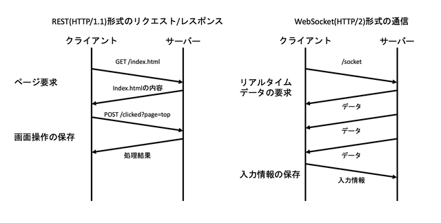
<figcaption>図2.4 HTTP/1.1とHTTP/2の違い</figcaption>
</figure>

### 第3節 ソフトウェア環境

ソフトウェアにおいて再現性が低くなる原因の1つが環境の差異である。同じプログラムでも先月まで動いたはずのものが動かなくなってしまったり、プラットフォーム(OSやCPUの組み合わせ)を変えたら動かなくなってしまったりするということは多々ある。<br>
卒業研究としてデモシステムを構築する以上、研究段階だけで動くだけでなく、できるだけ再現性を高める必要がある。また、再現性を高めることは本研究の主題である可搬性の向上にもつながる。本節ではソフトウェア環境をどのように整備するかについて論じる。

#### 第1項 インタプリタ言語

インタプリタ言語は実行前にコンパイルされないプログラミング言語のことである。コンパイルを経ないため、実行できるインタプリタさえあればどんなプラットフォームでも動作するという利点がある。インタプリタによって動作する言語の代表例にPythonがある。PythonではインタプリタによってOSの機能が抽象化されており、ファイル読み書きといったOSに依存してしまう操作でも同じコードで動作するようになっている。また、動作速度を速くすることやファイルサイズを小さくすることを求めるコンパイラ言語とは違い、インタプリタ言語、特にPythonでは利便性やコード量を減らすことを指向している。そのため、標準モジュールだけでCSVファイルの操作、WAVファイルの読み書き、ZIPファイルの圧縮・解答などができるようになっている。

Pythonが動作する仕組みは図2.5のような状態である。OS、CPUの組み合わせごとにPythonインタプリタがビルドされており、共通のPythonプログラムをPythonインタプリタが**通訳**することで動作している。

<figure>

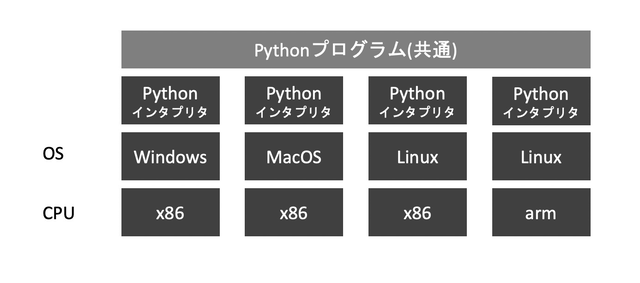
<figcaption>
図2.5 Pythonが動作する模式図
</figcaption>
</figure>

#### 第2項 Docker

Dockerとはコンテナ仮想化技術の1つである。コンテナとは仮想化されたバイナリ、ライブラリ、アプリケーションが一体になったもので、MacOSやWindows上でLinuxのOSでアプリケーションを立ち上げたものと同じ状態を再現することができる。<br>
類似した技術にVirtual Machineという技術がある。コンテナはVMとは異なり、仮想化対象のゲストOSをまるごと含めることはしない。そのため、VMと比べてコンテナは仮想化のオーバーヘッドを少なくすることができる。<br>
それに加えて、Dockerを使うことの大きなメリットは環境構築を半自動化できることにある。`Dockerfile` という名前をファイルを作成し、以下のように記述すると「`Ubuntu` OSをベースにし、 `build-essential`, `curl`, `git`, `unzip`, `vim`, `wget`, `sudo` というコマンドをインストールする。」という環境を定義することができる。

```plaintext
FROM ubuntu:20.04
RUN \
    apt update && \
    apt -y upgrade && \
    apt install -y build-essential && \
    apt install -y curl git man unzip vim wget sudo
```

このDockerfileさえ用意すれば、あとはプラットフォームごとのビルドはDockerが自動的に行う。もし追加で依存パッケージをインストールしたい場合、Dockerfileへ追加していく。一度ビルドしたDockerfileは追加の記述があった場合、差分だけをビルドするため初回よりも速くビルドすることができる。図2.6に示す通り、アプリケーションはこの仮想化されたコンテナ上で実行されるため、プラットフォームごとの差異を気にせずにアプリケーションを構築することができるのである。この模式図は図2.5のインタプリタ言語のものと類似点が多い。しかし、最も異なるのは任意のバイナリファイルが実行できるということである。PythonのインタプリタであればPythonしか実行できないのに対して大きな利点と言える。

<figure>


<figcaption>
図2.6 Dockerが動作する模式図
</figcaption>
</figure>

---

## 第3章 デモシステムの概要

まず、第1節で処理の流れについて、次に第2節で本デモシステムが採用した変調方式について説明する。その後、デモシステムの処理の流れに沿って8項に分けて説明する。

### 第1節 処理の流れ

システムの全体像は図3.1に示す通りである。大きく4つのパートに分かれており、送信側ソフトウェア、送信側回路、受信側回路、受信側ソフトウェアの順にデータが伝わっていく。送信側ソフトウェアで送信したいデータの音声データへの変換、送信側回路で音声信号の光信号への変換、受信側回路で光信号から電気信号(音声信号)への変換、受信側ソフトウェアで音声データから元データへの復元を行っている。<br>

<figure>

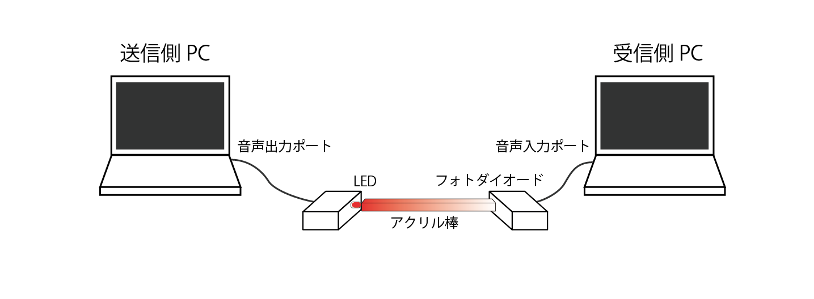

<figcaption>
図3.1 システムの全体像
</figcaption>
</figure>

さらに細かく処理の流れを表したものが図3.2のブロック図である。先程の説明と対応させると、データ受付から音声出力までが送信側PCの役割、LED明滅が送信側乖離の役割、フォトダイオードが受信側回路の役割、音声入力からデータの表示までが受信側PCの役割である。

<figure>

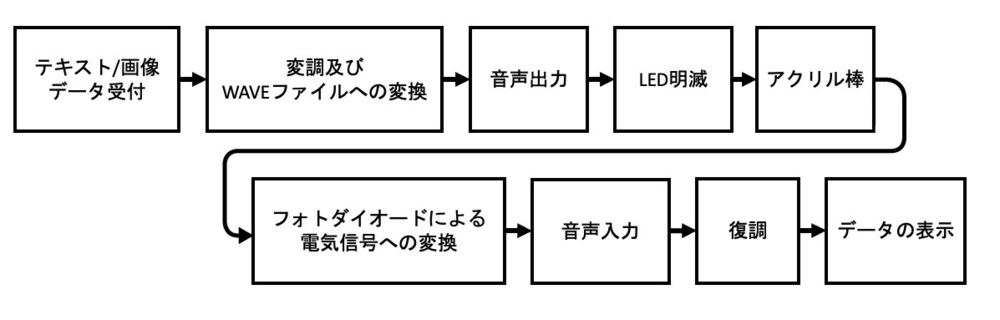

<figcaption>
図3.2 処理の流れを表したブロック図
</figcaption>
</figure>

### 第2節 変調方式

変調方式にはサブキャリアを用いた振幅変調方式を採用した。サブキャリアとは、副搬送波を変調した信号でさらに搬送波(今回の場合、光)を変調する方式のことである。このような複雑な変調方式を採用したのは低周波成分が欠落することを防ぐためである。

当初、搬送波に光をそのまま用いて、変調周波数を$4{,}800\rm{Hz}$程度としていた。この場合、フォトダイオードよって電気信号に変換された時点でパルス列になっている。その後、PCの音声入力ポートを経てA/Dコンバータによってサンプリングされる。このサンプリング回路中にコンデンサが含まれているため、低周波成分がカットされてしまうのである。パルス列の変調周波数は$4{,}800\rm{Hz}$であるものの、データの都合で同じ符号が並び周波数が極端に下がる場合がある。この際に図3.3に示す通り低周波成分がカットされ、復号が難しくなってしまうのである。

<figure style="width: 480px">

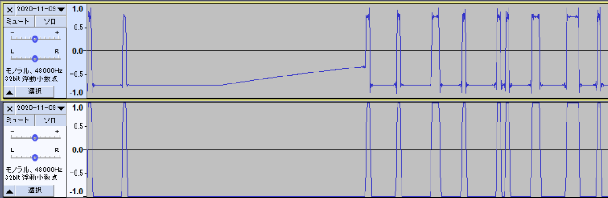

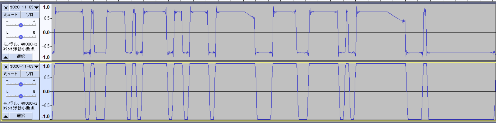

<figcaption>
図3.3 同じ信号が連続しコンデンサの影響が出ている2つの例<br>それぞれ上部が受信波形、下部が送信波形
</figcaption>
</figure>

これらの問題を解決するためにサブキャリアによる振幅変調方式を用いた。はじめ、副搬送波周波数を$4{,}800\rm{Hz}$、変調周波数を$1{,}200\rm{Hz}$として実験したところ、受信波形が安定するようになった。
サブキャリアで波形が安定した理由は、音声入力ポートを通る信号が副搬送波周波数の正弦波か、振幅が0の信号かどちらかであり、低周波成分を含まないからコンデンサの影響が小さくなったからである。<br>
その後、復調処理の実装が進み、サブキャリアを用いることで安定的に通信ができることが判明したため変調周波数を上げ、最終的に副搬送波周波数を$4{,}800\rm{Hz}$、変調周波数を$4{,}800\rm{Hz}$にすることで通信速度の向上を実現させた。変調周波数を副搬送波周波数と同じ$4{,}800\rm{Hz}$にした理由について詳しくは第4節第3項の復調で述べることにする。

このようにサブキャリアを用いて様々なハードウェア上の問題を解決しながら通信速度を向上させることを可能とした。

### 第3節 送信側システム

#### 第1項 データ受付

データを受け付ける画面はHTMLやJavaScriptを用いて WEBアプリケーションとして実装した。WEBの技術を用いた理由は2つある。OSを問わず表示することができるから、画像や音声、テキストといったマルチメディアを扱う方法として幅広く使われており、安定しているからで ある。特にOSを問わない点は可搬性を高めるとい う意味で重要な役割を果たしている。
テキストを送る場合の画面が図3.4に、画像を送る場合の画面が図3.5に示してある。HTML5 の機能の一つであるCanvasを使って簡易的に様々な色の線を描けるようにした。

<div class="fig-two-column" style="width: 540px; margin: auto">
<figure>


<figcaption>
図3.4 テキストデータを送信する例
</figcaption>
</figure>
<figure>

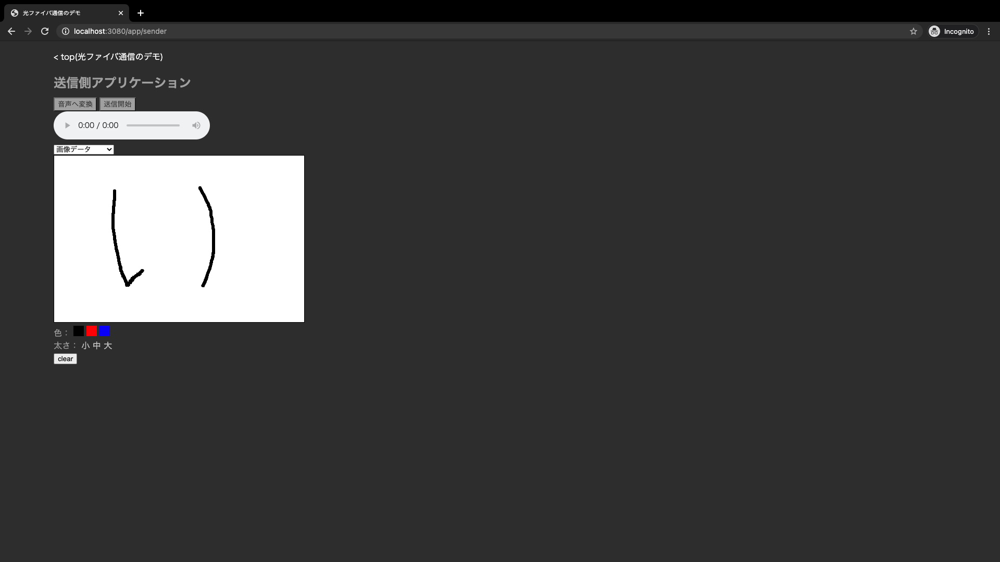

<figcaption>
図3.5 画像データを送信する例
</figcaption>
</figure>
</div>

#### 第2項 変調及びWAVEファイルへの変換

受付されたデータは図3.6に示す通り、一旦WebサーバーへHTTP通信を介して送られる。サーバーはデータを受け取った後、それをビット列に変えたあと、さらに変調信号に変換しWAVEファイルの記録フォーマットとして記録する。このWAVEファイルの形式の音声データを再びブラウザに返却する。
データを変換するためにわざわざサーバーを使っているのには大きく3つ理由がある。1つ目は執筆者がPythonで処理を書くことに慣れていたから、2つ目はPythonにはWAVEファイルの形式を作るための便利なライブラリがあったから、3つ目はデータを処理する役割をサーバーに、データを表示する役割をブラウザ側にと分担することでプログラムが整理しやすくなるからである。

<figure>

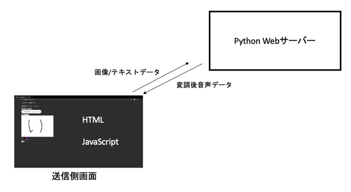

<figcaption>
図3.6 受け付けたデータをWAVEファイル形式の音声データに変換する際のデータの流れ
</figcaption>
</figure>

サーバー上のPythonのプログラムで変換処理をしているコードは以下の通りである。

```python
import io, itertools, struct, math, wave

def create_wavedata(image_bytes):
    fs = constants.SAMPLING_RATE  # サンプリング周波数 48,000Hz
    sub_career_freq = constants.SAMPLING_RATE // 10  # 搬送波周波数 4,800Hz
    # constants.ONE_BIT_SAMPLES = 10 (変調周波数 4,800Hz)

    def get_fragment(val):
        if val == 1:
            yield from (
                int(math.sin(
                    2 * math.pi * x / (fs // sub_career_freq)
                ) * constants.SHORT_MAX_VAL)
                for x
                in range(constants.ONE_BIT_SAMPLES)
            )
        else:
            yield from itertools.repeat(0, constants.ONE_BIT_SAMPLES)

    def get_bits():
        size_info_bytes = len(image_bytes).to_bytes(2, 'big')

        yield from constants.PREAMBLE
        yield from bytes_to_bits(size_info_bytes)
        yield from bytes_to_bits(image_bytes)

    def get_bytes():
        yield from [0] * (constants.ONE_BIT_SAMPLES // 2)
        yield from itertools.chain.from_iterable(
            get_fragment(val)
            for val
            in get_bits()
        )

    wave_val = list(get_bytes())
    bin_wave = struct.pack(f"{len(wave_val)}h", *wave_val)
    temp = io.BytesIO()
    w = wave.Wave_write(temp)
    w.setparams((1, 2, fs, len(bin_wave), 'NONE', 'not compressed'))
    w.writeframes(bin_wave)
    w.close()
    return temp.getvalue()
```

`get_fragment` 関数の中で、値が `1` の場合は $4{,}800\rm{Hz}$ の正弦波を10サンプルだけ発生させ、 `0` の場合は0で10サンプルを埋めるようにしている。これをプリアンブルと画像のビット列に適用し、`wave_val` という配列を生成する。さらに、Python標準モジュールである `wave` と `struct` を用いることで、WAVEファイルの形式へ変換している。<br>
なお、プリアンブルは固定長の3バイトの値と、`size_info_bytes` を組み合わせている。`size_info_bytes` は2バイトの情報で、送信するデータのサイズを整数値で表しており、表現できるのは0から65,535までとなっている。そのため、本デモシステムが送信できるのは65,535バイト、つまり65.5キロバイトの情報までとなる。

#### 第3項 音声出力

音声の再生においては特に特別な処理は行っておらず、変換された音声データをブラウザの標準機能をそのまま用いて再生している。通常、オーディオ再生を実装するにはOSのAPI操作をしなければならない。しかし、ブラウザを介してデバイスを操作することで環境の差異を無視できるようになった。
#### 第4項 LED明滅

今回のデモシステムではレーザーの代用としてLEDを用いた。LEDは1個十円から手に入る。そのため、本研究の主題である可搬性を実化するのに適した部品であると言える。

変調信号に合わせてLEDを明滅させる回路は図3.7に示す通りである。送信側のコンピュータの音声出力ポートから出た電気信号を電圧をシフトさせることで、LEDの照度と電圧が線形的に比例するようにしている。シフトさせる電圧を3.2Vにすると最も歪みが小さくなる[4]。この回路が動作することは図3.8に示す通りLTSpiceによるシミュレーションでも確かめられた。高い電圧のとき、24mA程度の電流が流れ、低い電圧のときは、電流が流れないようになっている。

<figure>

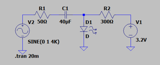

<figcaption>
図3.7 LEDを明滅させる回路
</figcaption>
</figure>
<figure>

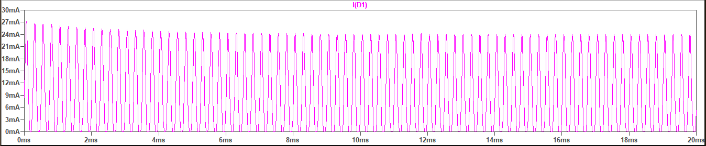

<figcaption>
図3.8 LTSpiceによるLEDに流れる電流のシミュレーション結果<br>(明瞭にするため色調反転した)
</figcaption>
</figure>

### 第4節 受信側システム

#### 第1項 フォトダイオードによる電気信号への変換

アクリル棒を伝わった光信号はフォトダイオードによって電気信号へ変換される。図3.9に示した回路の中央のチップがフォトダイオードである。OPT101という型番のフォトダイオードを使用した。OPT101はフォトダイオードとともにアンプも内蔵されており、帰還抵抗R1の$100\rm{k\Omega}$をつけることで出力が受信側コンピュータの音声入力ポートの許容電圧に収まるように増幅率を調整している。

<figure style="width: 600px">

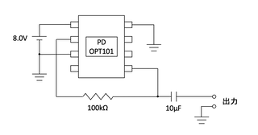

<figcaption>
図3.9 受信側の回路
</figcaption>
</figure>

#### 第2項 音声入力

フォトダイオードによって変換された電気信号は受信側PCの音声入力ポートに入力され、ブラウザ上のアプリケーションで録音される。その後、図3.10に示す通りリアルタイムに音声形式の受信波形データをサーバーへ送信している。録音中は常に新しいデータが溜まっていくため、第2章第2節第4項で紹介したWebSocketを利用してサーバーとやり取りしている。

<figure>

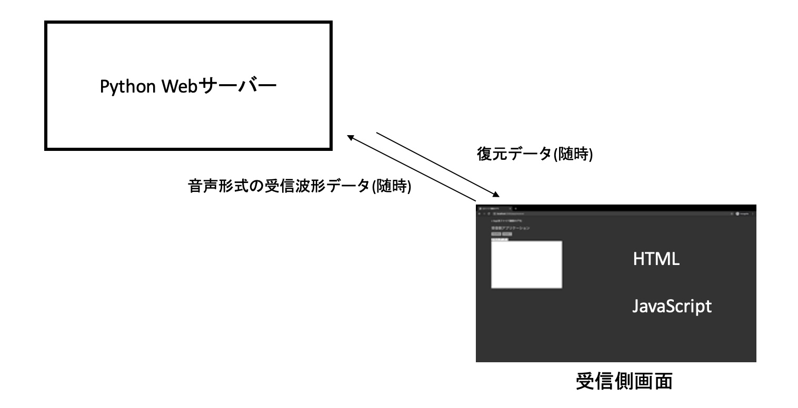

<figcaption>
図3.10 受信信号から復調する際のデータの流れ
</figcaption>
</figure>

#### 第3項 復調

本項では受信信号から元のデータを復調する処理について解説する。図3.10のPython Webサーバーにあたる部分の処理である。なお、復調処理をPythonで行っている理由は第3節第2項で説明した通り、執筆者がPythonに慣れているということに加えて、高速フーリエ変換を行うのにPythonの数値計算ライブラリであるnumpyを使うと簡単に実現できるからである。

第2節で述べた通り変調方式にはサブキャリアを採用し、副搬送波周波数及び変調周波数は以下のように設定した。

- サブキャリアの搬送波周波数: $48{,}000 \rm{Hz} / 10 = 4{,}800 \rm{Hz}$
- サブキャリアの変調周波数: $48{,}000 \rm{Hz} / 10 = 4{,}800 \rm{Hz}$

サブキャリアを採用したことによって受信波形が安定したが、それでも復調するにあたり困難が伴った。<br>
具体的には以下の4つの要因から受信側のコンピュータで記録された音声データのまま元の信号を復元することは難しい。

- 0Vの位置がずれてしまう
- 上下対称とは限らない
- 最大振幅のブレが大きい
- サンプル落ちが発生する場合がある

図3.11に受信側で録音された生のデータを示した。振幅が大きい部分が `1`, 振幅が小さいところが `0` を表していることは目視では確認できるものの、プログラムを書いて処理するにあたり、上記の問題からこの信号のまましきい値を設定することは困難である。また、サンプル落ちとは図3.12に示す通り音声が記録されていない区間が発生してしまう現象のことである。このサンプル落ちが発生する根本的な原因は調べても不明であったが、このサンプル落ちの区間を取り除いて処理を行うと正しく処理ができるようになった。コンピュータの処理の都合で音声の長さを調節するために挿入されたものだと考えられる。

<div class="fig-two-column">
<figure>


<figcaption>
図3.11 音声ファイルの元データ
</figcaption>
</figure>

<figure>

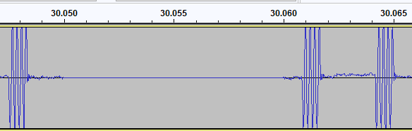

<figcaption>
図3.12 サンプル落ちが発生している例
</figcaption>
</figure>
</div>

これらの問題を解決するため、短時間フーリエ変換(STFT)と呼ばれる手法を用いて[5]、音声データに含まれる周波数の時間的な変化を調べた。短時間フーリエ変換は、ハンニング窓という窓関数を用いて数サンプルごとに音声データを分割し、それぞれに高速フーリエ変換をかけることで得られる。<br>

```python
from tqdm import tqdm
import numpy as np


def stft(s, Lf=80, overlap=None):
    if overlap is None:
        overlap = Lf // 2
    len_s = s.shape[0]
    win = np.hanning(Lf)
    Mf = overlap + 1
    Nf = int(np.ceil((len_s - overlap) / (Lf - overlap))) - 1
    S = np.empty([Mf, Nf], dtype=np.complex128)
    for n in tqdm(range(Nf)):
        S[:, n] = np.fft.rfft(
            s[(Lf - overlap) * n:(Lf - overlap) * n + Lf] * win,
            n=Lf,
            axis=0
        )
    return np.abs(S)
```

これを変調周波数 $1{,}200\rm{Hz}$ の信号に実行しプロットしたものが図3.13である。

図3.13を見ると、サブキャリアの搬送波周波数である $4{,}800\rm{Hz}$ を中心に色が濃く、周波数の強度が強くなっていることがわかる。

もともと、送信側のパソコンで発していた周波数は $4{,}800\rm{Hz}$ であったため、それ以外の周波数は無視して処理しても問題ない。そこで、仮想的に $3{,}900\rm{Hz}$ から $5{,}700\rm{Hz}$ までのバンドパスフィルタを通過したと考え、その区間の周波数強度を合計すると、信号成分以外の余計な周波数を取り除くことができる。そのように処理をし、時間-強度でプロットしたグラフが図3.14である。`1` と `0`のビットがしっかりと区別され、周波数強度150,000付近にしきい値を設ければ良いことがわかる。

<div class="fig-two-column">
<figure>

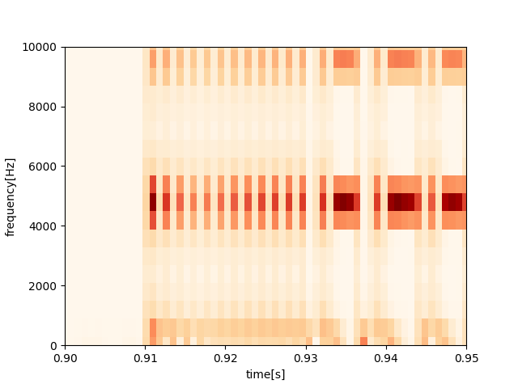

<figcaption>
図3.13 短時間フーリエ変換による周波数強度の時間変化のグラフ
</figcaption>
</figure>

<figure>

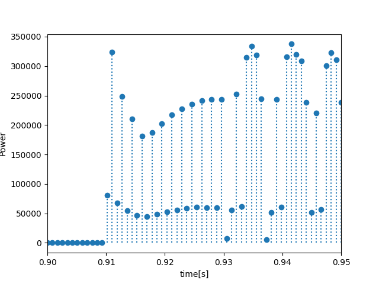

<figcaption>
図3.14 3,900Hz-5,700Hzの周波数強度の合計の時間変化
</figcaption>
</figure>
</div>

ところが、ここでさらに問題が発生した。単純に短時間フーリエ変換を行い周波数成分を抽出するだけではデータを取り出している間にビット誤りが起こった。図3.15に示すように、時間が経過するに連れて徐々に位相がずれていき、1であるはずの符号や0であるはずの符号がしきい値に近づいていったことが原因であった。位相がずれることで、隣り合うサンプルの信号が混ざるのである。ちょうど位相が反対になったところが図3.15の30秒の部分である。

<div class="fig-two-column">
<figure>

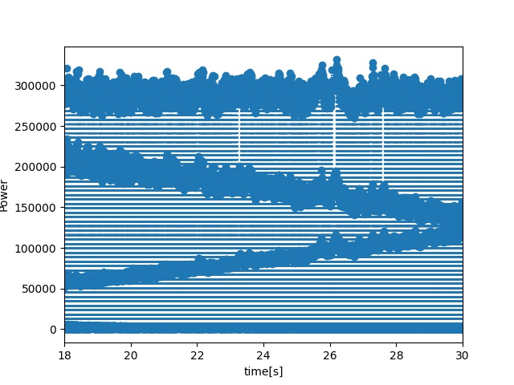

<figcaption>
図3.15 位相がずれていき、しきい値に近づいている様子
</figcaption>
</figure>
</div>

この問題を解決するために短時間フーリエ変換の結果の複素数の偏角、つまり位相の情報を活用することで、常に位相を合わせた状態で復調できるように工夫した。

```python
for (j, data) in enumerate(receive):
    audio_data.append(data)
    if j - last_j >= overlap and (not phase_adjust or j + phase_adjust <= len(audio_data)):
        def get_target():
            if phase_adjust:
                return audio_data[j - Lf + phase_adjust:j + phase_adjust] * win_func
            else:
                return audio_data[j - Lf:j] * win_func
        spectrogram = np.fft.rfft(get_target(), n=Lf, axis=0)
        a = np.abs(spectrogram)
        if a[target_band] > power_threshold:
            phase_diff = np.angle(spectrogram[target_band])
            center_width = 3.14 / half_sample
            if is_receiving and phase_diff >= center_width / 2:
                last_j = j - 1
            elif is_receiving and phase_diff <= -center_width / 2:
                last_j = j + 1
            else:
                last_j = j
            if not is_receiving:
                phase_adjust = -int(np.angle(spectrogram[target_band]) * half_sample / 3.14)
            is_receiving = True
            yield "1"
        elif is_receiving:
            last_j = j
            yield "0"
```

最初に信号を検知したときに `phase_adjust` を計算することで同期を行っている。その後、徐々にずれていく位相については、位相のズレが18度以上ずれたときに、36度だけ元に戻すようにしている。36度ごとの補正になっているのは、1サンプル分ずらすことが36度位相をずらすことに相当するためである。このように、最初に大きく補正し、あとは随時位相を補正していくことにより、安定的に復号を行えるようになった。
#### 第4項 データの表示

図3.10に示した通り、復元されたデータは随時ブラウザに届く。そのため、受け取ったデータを元に表示を更新することで、利用者からみてリアルタイムにデータが復元されているように見える。テキストデータも画像データもそれまで受け取ったデータを単純に結合し、HTMLを書き換えることで表示が更新される。画像データの形式はベースラインJPEGになっているため、途中までのデータでも座標が若いピクセルから徐々に表示されていく。<br>
また、データ全体のサイズも検知されるとサーバーから受け取れるようになっている。そこで、全体のどのくらいまでデータを受信したか表示するようにしてある。図3.16、図3.17に示してある通り、受信済みデータのバイト数、全体データのバイト数、推定残り時間が表示している。

<div class="fig-two-column" style="width: 600px; margin: auto;">
<figure>

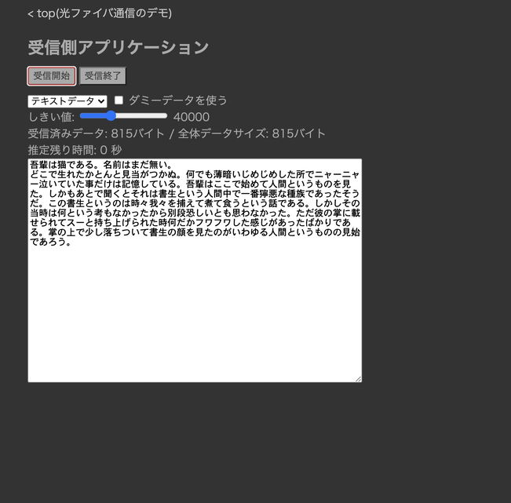

<figcaption>
図3.16 テキストデータを受信完了した例
</figcaption>
</figure>
<figure>

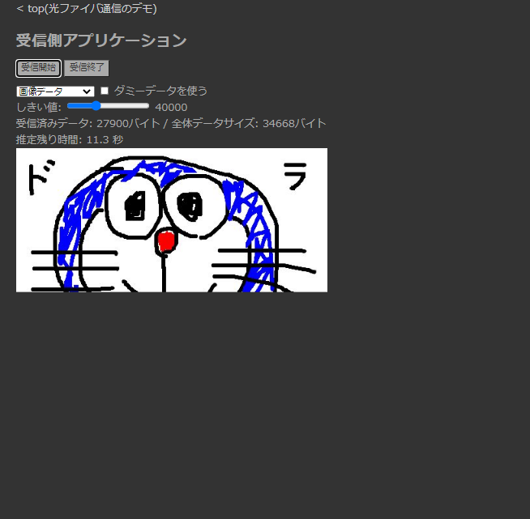

<figcaption>
図3.17 画像データを受信中の例
</figcaption>
</figure>
</div>

---

## 第4章 実験による実証

### 第1節 動作検証

基本的なデータ送受信ができることを確認するために3種類のデータを用意した。最も軽量なデータとしてテキストデータを、画像を送受信できることを確認するために軽量画像を、通信の安定性を確認するために大容量画像を用意した。

テキストには青空文庫から夏目漱石の吾輩は猫であるを用いた。UTF-8でエンコードし、815バイトのデータとなった。

> 吾輩は猫である。名前はまだ無い。<br>
> どこで生れたかとんと見当がつかぬ。何でも薄暗いじめじめした所でニャーニャー泣いていた事だけは記憶している。吾輩はここで始めて人間というものを見た。しかもあとで聞くとそれは書生という人間中で一番獰悪な種族であったそうだ。この書生というのは時々我々を捕えて煮て食うという話である。しかしその当時は何という考もなかったから別段恐しいとも思わなかった。ただ彼の掌に載せられてスーと持ち上げられた時何だかフワフワした感じがあったばかりである。掌の上で少し落ちついて書生の顔を見たのがいわゆる人間というものの見始であろう。

軽量画像はデモシステムの送信画面で `A` と手で書いたものを用いた。JPEG形式でフォーマットされており、4,248バイトのデータとなった。

大容量画像はデモシステムの送信画面でドラえもんを描いたものを用いた。この画像もJPEG形式でフォーマットされており、34,277バイトのデータとなった。ドラえもんを用いた理由は、筆者が描ける絵の中で最も複雑で、色数が多いキャラクターであったからである。

<div class="fig-two-column">
<figure class="image-with-border">


<figcaption>図4.1 軽量画像として用意した画像<br>(480x320ピクセル)</figcaption>
</figure>

<figure class="image-with-border">


<figcaption>図4.2 大容量画像として用意した画像<br>(480x320ピクセル)</figcaption>
</figure>
</div>

結果は表4.1の通りである。全体で30回伝送し、そのうち29回成功した。失敗した1回はプリアンブルの検知に失敗したことが原因であったため、プリアンブルの検知に成功すれば100%の確率で伝送に成功していると言える。

<figure>
<figcaption>表4.1 10回ずつデータを送った際の成否と送信時間</figcaption>

| 種類       | サイズ | 試行回数 | 成功回数 | 伝送にかかった時間 |
| ---------- | -----: | -------: | -------: | -----------------: |
| テキスト   |   815B |     10回 |     10回 |                1秒 |
| 軽量画像   | 4.08KB |     10回 |      9回 |              5.2秒 |
| 大容量画像 | 34.6KB |     10回 |     10回 |               39秒 |

</figure>

### 第2節 通信速度の検証

通信速度はほぼ理論値通りとなった。送信側PCの変調信号音声の再生が完了するとともに1秒以内に受信側PCでもデータ復元されることは実験で確認した。
理論値は変調周波数が$4{,}800\rm{Hz}$であるため、4,800ビット毎秒 $=$ 600バイト毎秒となる。これは本デモシステムが受付可能な最大の65,535バイトの情報でも、109.2秒で伝送できることを示している。通信速度の面において十分実用的なシステムになったと言える。

### 第3節 通信の安定性の検証

第1節で述べた通り、本デモシステムは高い安定性を示した。基本的な実験ではビットエラーが発生しなかったが、発生すると受信画像はどのように変化するのかを調べてみた。プリアンブル検知成功後、画像の半分くらいまで伝送が完了したところでアクリル棒を揺らし、ビットエラーを発生させた。図4.3に示す通り、途中から画像が大きく崩れていることが分かる。今回、誤り訂正符号やパリティチェックを実装しなかったため、自動的にビット誤りを検知したり、修復することはできなかった。

<figure class="image-with-border">

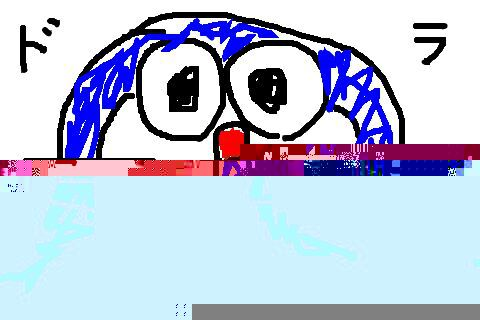

<figcaption>
図4.3 43KBのJPEG画像を伝送した際にわざとアクリル棒を揺らした場合の受信画像
</figcaption>
</figure>

---

## 第5章 今後の展望

本章では、光ファイバー通信デモシステムをより完成度が高いものにするために何が必要か論じる。論点には、通信速度、安定性、可搬性の3つを用意した。通信速度と安定性が向上することで、デモシステムを紹介する際により高度なパフォーマンスを行えるようになると期待できる。また、可搬性が向上することによって、より多くの人が本デモシステムを再現でき、光ファイバー通信の啓蒙につながると考えられる。

### 第1節 通信速度について

今回の研究では通信速度は、最終的に600バイト毎秒という結果になった。これは1993年に発表された赤外線通信の規格の115キロビット毎秒 $=$ 14,375バイト毎秒[6]からするとかなり遅いと言える。

この通信速度を向上させるには、まず搬送波周波数を高くし、その上で変調周波数を高める必要がある。<br>
搬送波周波数の最高値は音声のサンプリング周波数に依存おり、録音ソフトのAudacityのサンプリング周波数の最高値は$384{,}000\rm{Hz}$となっている。そのため、4サンプルで1ビットを表現する場合、96キロビット毎秒と、1993年の赤外線通信の通信速度に匹敵する速度を出せると期待できる。ただ、高周波の音声信号を生成した際にPCに付属したサウンドデバイスがしっかりと記録できるかは未知数である。
### 第2節 通信の安定性について

4章で示した通り通信の成功率は非常に高いものとなった。ただ、ビット誤りが発生した場合に検知をする方法が存在しないため、人が目視で誤りを探す必要がある。また、伝送に失敗したときに再送する場合も手作業で行っている。<br>
これらを自動化するために誤り訂正符号の導入と、パケット再送の処理を追加するということが考えられる。誤り訂正符号についてはPythonの符号化処理と復号処理を書き換えることで行える。パケット再送は、デモシステムをもう一度構築し直す必要がある。パケットの概念は双方向的に通信を行うシステムで考えられるものであり、肯定応答を返すかどうかで受信が成功したかどうかを判断する。送信と受信を同時に行えるようにシステムを作ることはかなり難易度が高いであろう。

### 第3節 可搬性について

信号処理システムを構築する際に仮想環境ソフトとしてDockerを用いた。仮想環境を介することで、依存パッケージのインストールを自動化し、プラットフォームの差異を無視できるようになった。しかし、Dockerは一般的なPC利用者にインストールされているわけではないため、Dockerをインストールする手順が必要になる。特にWindowsではDockerをセットアップするための手順が複雑であり、すべてのユーザーに対して使いやすいとは言えない状況となっている。

この問題を解消するために、Webアプリケーションとして公開すれば利用者の手間を減らすことができる。ただ、Webアプリケーションとして公開するにはサーバーをレンタルする必要があり、月数千円の出費となってしまう。<br>
そこで、信号処理システムをJavaScriptで実装し直すことで、静的なウェブページとすることが最も効果的な対処方法であると考えられる。静的なウェブページのホスティングは、本学では無料のサービスとして提供されており、学生は50MBまでの容量であれば利用することができる[7]。JavaScriptで短時間フーリエ変換を実装する必要があるなど多少の困難が伴うが、実現可能であると言える。

## 第6章 まとめ

本論文では汎用的な技術を用いることで可搬性の高い光ファイバーデモシステムについて研究した。通信用途を想定していないデバイスを用いて安定的な通信システムを作るには多くの困難が伴ったが、変調方式を工夫したり、短時間フーリエ変換といった手法を用いたりすることで、可搬性と安定性を両立したデモシステムを構築することができた。4章の実験においても基本的な動作確認で高い安定性を確認することができ、完成度が高いデモシステムを作ることができたと言える。

## 謝辞

本研究にあたり多大なる助言と力添えをくださった高橋浩教授に深く感謝を申し上げます。また、電気回路の設計では、昨年の小原先輩の卒業論文を参考にしました。心よりお礼申し上げます。

---

## 参考文献

<div class="refs">

1. "トラヒック（首都圏・大阪）"、https://www.jpix.ad.jp/jp/technical_traffic.php 、2021年1月22日最終アクセス
1. "ISO/IEC7498-1第2版"、https://www.ecma-international.org/activities/Communications/TG11/s020269e.pdf 、2021年1月22日最終アクセス
1. "グラフィカルユーザインタフェース Wikipedia"、https://ja.wikipedia.org/wiki/グラフィカルユーザーインターフェース#歴史 、2021年1月24日最終アクセス
1. 小原達也、"汎用コンピュータを用いたデジタル光通信システムの研究"、上智大学理工学部情報理工学科卒業論文、2020年2月
1. "pythonで音響信号処理②〜STFT(短時間フーリエ変換)でスペクトログラムをみる〜"、https://moromi-senpy.hatenablog.com/entry/2019/04/27/155219 、2021年1月22日最終アクセス
1. "iPhoneには赤外線がないけど消えゆく技術なの？ (1/4)"、https://monoist.atmarkit.co.jp/mn/articles/0809/19/news126.html 、2021年1月22日最終アクセス
1. "Webサイトを作成する（pwebの利用）"、https://ccweb.cc.sophia.ac.jp/userguide/service/sv-03/ 、2021年1月22日最終アクセス

</div>

---

## 付録

### デモシステムを自分で動かす場合の手順
